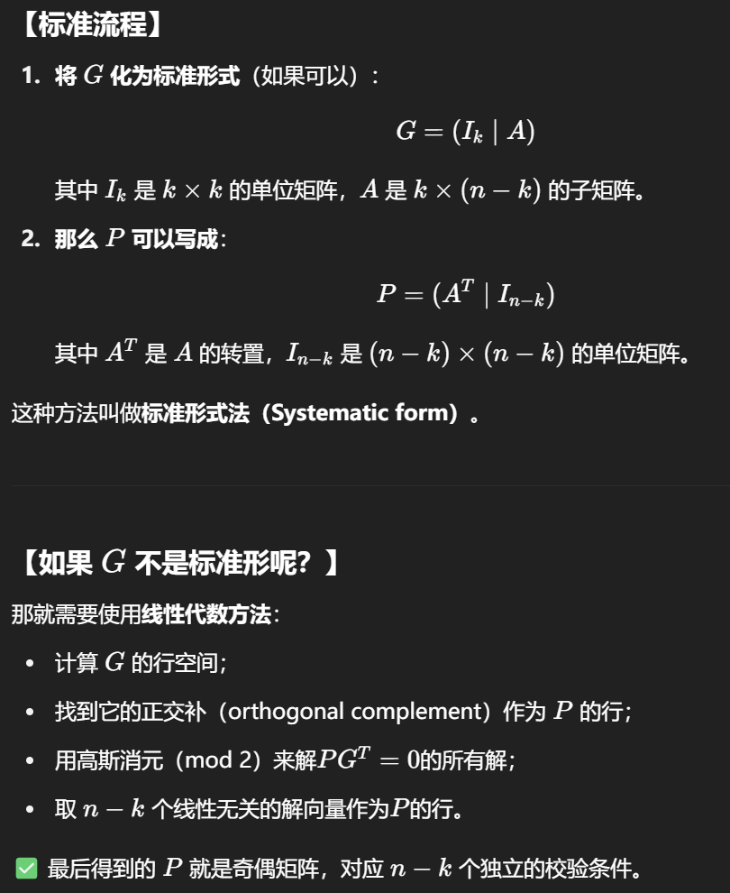

# 经典编码

经典编码理论通常集中研究**线性码（linear codes）**，即所有可能码字（codewords）的集合中具有特定关系的子类。假设我们希望用n个比特（bits）对k个比特的数据进行编码(normally, n > k)。数据可以表示为一个k维的二进制向量$v$。由于处理的是二进制向量，因此所有的运算都是模2（mod 2）意义下进行的。对于线性码，编码后的数据是$n\times k$矩阵$G$（矩阵中的元素为二元域$Z_2$中的元素）乘以$v$得到的，即$Gv$。注意矩阵$G$不依赖于$v$。矩阵$G$被称作该编码的**生成矩阵（generator matrix）**。矩阵的每一列构成了$n$维二进制向量空间中一个$k$维的子空间的基，这些列被称作基码字（basis codewords）。最一般的码字可由这些基码字线性组合得到，这也是“线性码”名称的来源。

给定生成矩阵$G$，我们可以计算它的对偶矩阵$P$，它是一个$(n-k)\times n$的0-1矩阵，秩（rank）为最大可能值$n-k$，且满足$PG=0$。由于任一码字$s$的形式都是$Gv$，所以$P s = P G v = 0 v = 0$，也就是说矩阵$P$将消除任一码字。反过来，如果某向量$s$满足$P s = 0$，那么由于$P$的秩为$n-k$，它只消除由$G$的列向量构成的$k$维子空间中的向量，因此$s$必然是这些列的某个线性组合，即$s=Gv$，也就是说$s$是一个有效的码字。矩阵$P$被称为该编码的**校验矩阵（parity check matrix）**。它可以用来测试一个给定向量是否为有效的码字，因为当且仅当$P s=0$时，$s$才是码字。我们称与$G$对应的校验矩阵$P^T$定义的码为**对偶码（dual code）**。

> Remark:
>
> [1]对偶矩阵定义
>
> 对于一个**线性码 C**，其生成矩阵 G 是一个 $n \times k$ 的矩阵。C 是 G 的行空间（Row space).定义**对偶码**$C^\perp$: 所有与 C 中所有向量正交（在$\mathbb{F}_2$域上）的向量集合。
> $$
> C^\perp = \{ v \in \mathbb{F}_2^n \mid \forall w \in C, \langle v, w \rangle = 0 \}
> $$
> 其中内积 $\langle v, w \rangle$ 是指**二进制域上的内积**（即逐位乘法后再模2求和）。
>
> **对偶矩阵 P** 是一个生成对偶码 $C^\perp$ 的矩阵；它的行向量是 $C^\perp$​ 的一组基（basis）。维度是P 是一个 $(n-k) \times n$的矩阵,满足$P G = 0$
>
> G张成的是一个k维子空间 $C\subset \mathbb{F}_2^n$；P张成的是其正交补 $C^\perp\subset \mathbb{F}_2^n$；它们满足：
> $$
> \dim(C) + \dim(C^\perp) = n
> $$
> [2]据生成矩阵 G 求对偶矩阵 P
>
> 
>
> [3] 检验原理
>
> G生成的是所有合法码字。对任意合法码字 v，有 $v = Gm$​（m是信息比特，乘以生成矩阵）。那么$P v = P (Gm) = (P G) m = 0 \times m = 0$,如果有错误出现, 错误码字 v′ 不一定满足 $P v' = 0$,产生一个**错误综合症（syndrome）**；

为了分析码的纠错特性，研究码字间的**汉明距离（Hamming distance）是非常有用的。两个向量之间的汉明距离是将其中一个向量转变为另一个向量需要翻转的最少比特数量。两个向量$a$和$b$之间的距离等于$a+b$（模2意义下）中的1的个数，这称为该向量的权重（weight）**。一个码如果要纠正最多$t$个单比特错误，任意两个码字之间至少要有$2t+1$的汉明距离。当码字间距离至少为$2t+1$时，我们能区分不同码字上的错误，并将错误的码字校正回正确的码字。能够将$k$个比特的数据编码到$n$个比特且最小距离为$d$的码，记作$[n,k,d]$码。

现在假设我们考虑一个$t$比特的错误。我们可用一个向量$e$表示这个错误，向量中比特翻转的位置为1，其余位置为0。如果原始码字为$s$，那么错误发生后的码字为$s'=s+e$。将校验矩阵作用在这个错误码字上，有：
$$
P s' = P (s + e) = P s + P e = 0 + P e = P e.
$$
因此，$P s'$的值与$s$无关，仅取决于$e$。**如果对所有可能的错误$e$而言，$P e$都不同，我们就能准确判断错误的具体位置并修正它**。我们称$P e$为**错误症状（error syndrome）**，因为它告诉我们错误的位置。由于$P e = P f$， 当且仅当$P(e-f)=0$，为了获得距离$d$的码，所有重量小于等于$d-1$的向量$e$必须满足$P e \ne 0$。等价而言，矩阵$P$的任意$d-1$列必须线性无关。[1]

> Remark
>
> [1]的证明：
>
> 设$G: n \times k$ 的生成矩阵, $P: (n-k) \times n$的对偶矩阵.
>
> 由于我们希望对某个编码码距之内的所有可能的错误e而言，$Pe$都不同。即
> $$
> \forall s+e,s+f \in \mathcal{D}(s,d)(\text{以原编码s为球心，d为码距的汉明球之内}),若Pe = Pf, 则e = f.
> $$
>
> $$
> Pe=\begin{pmatrix} \sum_{k=1}^n P_{1k} e_k \\ \sum_{k=1}^n P_{2k} e_k \\ \vdots \\ \sum_{k=1}^n P_{n-k,k} e_k \end{pmatrix}
> $$
>
> $$
> Pf =\begin{pmatrix} \sum_{k=1}^n P_{1k} f_k \\ \sum_{k=1}^n P_{2k} f_k \\ \vdots \\ \sum_{k=1}^n P_{n-k,k} f_k \end{pmatrix}
> $$
>
> $$
> Pe - Pf =  \begin{pmatrix} \sum_{k=1}^n P_{1k} (e_k - f_k) \\ \sum_{k=1}^n P_{2k} (e_k - f_k) \\ \vdots \\ \sum_{k=1}^n P_{n-k,k} (e_k - f_k) \end{pmatrix} = 0
> $$
>
> 等价于
> $$
> (e_1 - f_1)  \begin{pmatrix} P_{1,1} \\ P_{2,1} \\ \vdots \\ P_{n-k,1} \end{pmatrix} + (e_2 - f_2)  \begin{pmatrix} P_{1,2} \\ P_{2,2} \\ \vdots \\ P_{n-k,2} \end{pmatrix} +\cdots+ (e_{d-1} - f_{d-1})  \begin{pmatrix} P_{1,d-1} \\ P_{2,d-1} \\ \vdots \\ P_{n-k,d-1} \end{pmatrix} = 0
> $$
> 当且仅当$e_i - f_i = 0$，所以对应的$d-1$列线性无关

> Remark:
>
> ## 📌 一、背景设定
>
> 我们考虑的是一个 $[n, k, d]$的**线性码**，即：
>
> - 总比特数：n
> - 信息比特数：k
> - 最小汉明距离：d
>
> 其校验矩阵 P 的维度为 $(n - k) \times n$，用于判断一个向量是否为合法码字。
>
> ------
>
> ## 📌 二、错误综合症的定义与判别标准
>
> 设有两个错误向量 $e,f \in \mathbb{F}_2^n$，我们在接收到的码字上分别加上这些错误：
>
> - 若两个错误向量导致相同的错误综合症，即：
>   $$
>   P e = P f
>   $$
>   那么我们就**无法区分这两种错误**。
>
> - 将等式变形：
>   $$
>   P e = P f \iff P(e - f) = 0
>   $$
>   也就是说，**两个错误向量只有在差值 e - f 被校验矩阵映射为0时，才会得到相同的综合症**。
>
> 因此，为了确保每种错误都能被唯一识别，我们要求：
>
> > 任何非零的、重量（即1的个数）不超过 d−1 的错误向量 e，都必须满足 $P e \ne 0$。
>
> ------
>
> ## 📌 三、错误与矩阵列的关系
>
> 对于一个错误向量 e，它可以看作是一个稀疏向量，只有少数几个位置为1，其余为0。例如：
> $$
> e = (0, 1, 0, 0, 1, 0, \dots)
> $$
> 则 $P e$ 就是将 $P$ 的对应列相加（模2）：
> $$
> P e = P \cdot e = \sum_{i \in \text{支持}(e)} P_i
> $$
> 其中，$P_i$ 表示校验矩阵的第 $i$ 列。
>
> 因此：
>
> - **如果 e 的重量为 $w \le d-1$，且 $P e = 0$**，说明**这 w 列的和为0**，也就是这些列是**线性相关的**。
> - 若想让所有 $\text{wt}(e) \le d-1$ 的 e 都满足 $P e \ne 0$，就必须保证：**任意 $d-1$ 列线性无关！**
>
> ------
>
> ## ✅ 四、总结推理逻辑
>
> 
>
> | 条件                                       | 推理结论                                |
> | ------------------------------------------ | --------------------------------------- |
> | $P e = P f$ 当且仅当 $P(e - f) = 0$        | 如果错误差值落入 P 的零空间，就无法区分 |
> | $P e = 0$ 意味着某些列和为0                | 即这几列线性相关                        |
> | 若要检测所有 $\text{wt}(e) \le d-1$ 的错误 | 所有 $d-1$ 列必须线性无关               |
>
> 因此：
>
> $\boxed{\text{一个线性码的最小距离 } d \text{，等价于校验矩阵 } P \text{ 中任意 } d-1 \text{ 列线性无关}}$
>
> ------
>
> ## 📌 五、几何/线性代数视角理解
>
> 从向量空间角度看：
>
> - 校验矩阵 P 的列是 $\mathbb{F}_2^{n-k}$ 空间中的向量。
> - 如果某  t 个错误导致这些列线性相关（即和为0），就无法检测出这些错误。
> - 所以我们希望任意 d−1 个这样的向量都是线性无关的 → 保证检测力。
>
> ------
>
> ## ✅ 六、小结
>
> 
>
> | 表述                                                 | 意义                              |
> | ---------------------------------------------------- | --------------------------------- |
> | $P e = P f \iff P(e - f) = 0$                        | 综合症相同意味着两个错误“等价”    |
> | 若有某个非零 e 满足 $P e = 0$，就检测不到这个错误    | 所以必须避免这种情况              |
> | 所有 $\text{wt}(e) \le d-1$ 的错误都要有 $P e \ne 0$ | 确保检测到所有可纠错错误          |
> | 这等价于 P 的任意 $d-1$ 列线性无关                   | 这是码最小距离 d 的线性代数表达式 |

我们可以对纠正$t$个错误的线性码的存在性做出上下界估计。每个$2^k$个码字都有一个半径为$t$的汉明球（Hamming sphere）。一个汉明球内的所有向量都是由相同码字发生错误后得到的。对于$n$个比特的编码来说，存在$n$个1比特错误、$\binom{n}{2}$个2比特错误，依此类推。汉明球不能重叠，但必须全部放入仅有$2^n$个元素的向量空间中，因此：
$$
\sum_{j=0}^{t}\binom{n}{j}2^k\leq 2^n
$$

> Remark:
>
> ### 📌 第四部分：
>
> > “对于 n 个比特的编码来说，存在 n 个 1 比特错误、$\binom{n}{2}$ 个 2 比特错误，依此类推。”
>
> 这是在说**一个汉明球包含多少个点**（也叫“体积”）：
>
> - 0位错误：1 个（就是原码字自己）
> - 1位错误：从 n 位中任选1位翻转 → 有 $\binom{n}{1}$ 个
> - 2位错误：任选2位翻转 → 有 $\binom{n}{2}$ 个
> - ⋯⋯
> - t位错误：有 $\binom{n}{t}$ 个
>
> 所以，半径为 t 的汉明球的大小是：
> $$
> V(n,t) = \sum_{i=0}^{t} \binom{n}{i}
> $$
> 
>
> ------
>
> ### 📌 第五部分：
>
> > “汉明球不能重叠，但必须全部放入仅有 $2^n$ 个元素的向量空间中。”
>
> 这是**汉明界的核心思想**：
>
> - 整个 n-比特向量空间共有 $2^n$ 个不同向量。
> - 如果你有 $2^k$ 个码字，每个码字都“占据”一个半径为 t 的汉明球，这些球必须**不重叠**，否则就无法唯一纠错。
> - 所有这些球的并集必须放进整个空间中。
>
> 换句话说：
> $$
> 2^k \cdot \left( \sum_{i=0}^{t} \binom{n}{i} \right) \le 2^n
> $$
> 这就是著名的**汉明界（Hamming bound）**：
> $$
> \boxed{ \sum_{i=0}^{t} \binom{n}{i} \cdot 2^k \le 2^n }
> $$
> 如果这个不等式成立，说明这样的码是可能存在的；如果不成立，说明空间不够用了，汉明球之间会“重叠”，就无法唯一纠错了。
>
> ------
>
> ### ✅ 总结（一图胜千言）
>
> 你可以这样想：
>
> - 整个 $2^n$ 空间像一个有限大的“盒子”。
> - 每个码字的“错误可能性”形成一个球。
> - 球不能互相重叠，否则无法判断收到的错误向量原本属于哪个码字。
> - 所有球必须能装入这个盒子里 → 得到容量限制 → 汉明界。

这被称作对$[n,k,2t+1]$码的**汉明界（Hamming bound）**。随着$n,k,t$增大，这个界限逐渐接近其渐进形式：
$$
\frac{k}{n}\leq 1-H\left(\frac{t}{n}\right)
$$
其中$H(x)$为汉明熵（Hamming entropy）：
$$
H(x)=-x\log_2 x - (1-x)\log_2(1-x)
$$
类似地，我们也可以对$[n,k,2t+1]$线性码的存在性设定下界，这被称作**Gilbert-Varshamov界**。假设存在这样的码（若必要时可设$k=0$）：
$$
\sum_{j=0}^{2t}\binom{n}{j}2^k< 2^n.
$$
那么，以每个码字为中心半径为$2t$的球未填满整个空间，必然存在某个向量$v$到每个码字的距离至少为$2t+1$。于是，我们可以将向量$v$及所有形式为$v+s$（$s$为任一码字）的向量加入到原有编码中，而不会降低最小距离$2t+1$，构造出一个新的$[n,k+1,2t+1]$码。不断重复该过程，直到：
$$
\sum_{j=0}^{2t}\binom{n}{j}2^k\ge 2^n.j=0
$$
渐进地，这成为：
$$
\frac{k}{n}\geq 1-H\left(\frac{2t}{n}\right).
$$

> Remark
>
> 这里的上下边界是码率($\frac{k}{n}$)的上下边界。
>
> ## ✅ 一、背景：为什么还要有“下界”？
>
> 在前面我们提到的**汉明界（Hamming Bound）是一个上界**：
> $$
> 2^k \cdot \sum_{i=0}^t \binom{n}{i} \le 2^n
> $$
> 表示：**想要纠错 t 个错误，码字数最多不能超过多少**。
>
> 但这只是说“超过这个数量一定不行”，我们还想知道：
>
> > ✅ “有没有办法构造一个纠错 t 个错误的码，使码字数至少达到多少？”
>
> 也就是一个“**下界**”：保证某种码确实存在，并且纠错能力不错。**Gilbert–Varshamov 界**就是这么一个“存在性下界”。
>
> ------
>
> ## ✅ 二、关键步骤回顾
>
> ### 📌 1. 初始：我们从 $k=0$ 开始，只有一个码字（如全零）
>
> - 半径为 $2t$ 的球表示这个码字所能容忍的错误范围；
> - 它的体积为 $V(n, 2t) = \sum_{j=0}^{2t} \binom{n}{j}$
>
> ### 📌 2. 发现：这个球**没有填满整个空间**
>
> - 整个空间大小为 $2^n$
> - 所以剩下的空间中必然还有**距离所有码字至少为 $2t+1$** 的向量 $v$
>
> ### 📌 3. 我们可以“贪心地”把 $v$ 加进去作为新码字！
>
> - 因为它距离旧的所有码字都 $≥ 2t+1$，不会破坏最小距离；
> - 然后，把以 v 为中心的新汉明球也放进来；
> - 这样，我们就得到了一个新的码，码字数量从 $2^k \rightarrow 2^{k+1}$
>
> ### 📌 4. 不断重复这个过程
>
> - 每次加入一个新码字和对应的球；
> - 一直到无法再塞下一个“距离所有已有码字 $≥ 2t+1$”的新码字为止；
> - 这个“极限点”就是：
>
> $$
> \sum_{j=0}^{2t} \binom{n}{j} \cdot 2^k \ge 2^n
> $$
>
> 即：不能再往空间里放更多互不重叠的球了。
>
> ------
>
> ## ✅ 三、渐进行为（Asymptotic Behavior）
>
> 当 $n \to \infty$ 时，可以对上式两边取对数并除以 n，得到渐近形式：
> $$
> \frac{k}{n} \ge 1 - H\left( \frac{2t}{n} \right)
> $$
> 这就是 **Gilbert–Varshamov 下界**。
>
> ------
>
> ## ✅ 四、“这一步”的意义总结
>
> 你问的“这一步”的意义，其实就是：
>
> > ✅ **在理论上证明：存在一些线性码，最小距离大于等于 $2t+1$，码率 $R = \frac{k}{n}$ 至少可以达到 $1 - H\left( \frac{2t}{n} \right)$。**
>
> 即使我们不具体构造出这些码，但它们**确实存在**。
>
> ------
>
> ## ✅ 五、对比汉明界和Gilbert–Varshamov界的含义
>
> 
>
> | 上界（Hamming Bound）  | 下界（Gilbert–Varshamov Bound） |
> | ---------------------- | ------------------------------- |
> | 超过此码字数将不可纠错 | 至少存在这么多码字能纠错        |
> | 是不能突破的限制       | 是可以达到的保证                |
> | 对应式：$ \le 2^n$     | 对应式：$\ge 2^n$               |
>
> ------
>
> ## ✅ 六、图像化解释（可选）
>
> - 把整个 $2^n$ 空间看成一个“盒子”
> - 每个码字对应一个汉明球（半径 $2t$）
> - 贪心地往这个盒子里放球（码字）；
> - 一直到空间快满了，不能放更多球；
> - 所以这些球就构成了一个最小距离 $≥ 2t+1$ 的码；
> - 这样我们得到一个 **可行码的存在性保证**。
>
> ------
>
> ## ✅ 七、一句话总结
>
> 你提到的这一步，揭示了：
>
> > 通过不断加入“互不干扰”的新码字，可以构造出一个最小距离 ≥ 2t+12t+12t+1 的线性码，其码率至少为 $1 - H\left( \frac{2t}{n} \right)$。这就是 Gilbert–Varshamov 下界的核心逻辑与意义。

另一个非常重要的情况是**经典信道容量（channel capacity）**。信道容量即纠正信道错误的最优编码效率$k/n$。常见的信道为二进制对称信道（binary symmetric channel），每个比特出现错误的概率为$p$。香农（Shannon）证明了该信道容量为$1-H(p)$，且可通过随机选取码字，并仅舍弃极少数（渐进意义下为测度零）码字达到这个容量极限。

> Remark
>
> ## ✅ 在一个 $[n, k, d]$线性码中：
>
> - n：码字长度（**编码后的比特数**）
> - k：信息长度（**原始数据的比特数**）
> - d：最小汉明距离（**任意两个码字之间的最小距离**）
>
> 我们来详细说明：
>
> ------
>
> ### 🔹 k：信息位数（data bits）
>
> - 表示原始输入数据的比特数。
> - 一共有 $2^k$ 个不同的信息向量。
> - 每一个 k-比特的信息，都会被编码成一个长度为 n 的**码字**。
>
> 比如：
>
> - 原始信息 $v = (1, 0, 1, 1)$，长度为 4 ⇒ $k=4$
> - 编码后可能得到码字 $s = (1, 0, 1, 1, 0, 1, 1)$，长度为 7 ⇒ $n = 7$
>
> ------
>
> ### 🔹 n：码字位数（codeword bits）
>
> - 表示编码后的码字长度，即传输中发送的比特数。
> - $n > k$，因为我们加了一些冗余位来帮助纠错。
>
> ------
>
> ### 🔹 d：最小汉明距离
>
> - 任意两个合法码字之间的最小汉明距离。
> - 决定了这个码可以：
>   - **检测** $d - 1$ 个错误；
>   - **纠正** 最多 $\left\lfloor \frac{d - 1}{2} \right\rfloor$ 个错误。
>
> ## ✅ 举例说明：
>
> 设有一个 [7,4,3] 的线性码（经典汉明码）：
>
> 
>
> | 符号  | 含义                                           |
> | ----- | ---------------------------------------------- |
> | n = 7 | 每个码字7位长（用于传输）                      |
> | k = 4 | 每个码字编码了4位原始信息                      |
> | d = 3 | 最小汉明距离为3 ⇒ 可以纠正1位错误、检测2位错误 |
>
> ------
>
> ## ✅ 额外：码率（rate）
>
> 码率是衡量效率的重要指标，定义为：
> $$
> R = \frac{k}{n}
> $$
> 
>
> - 表示单位传输比特中，多少是有效信息；
> - 码率越高，效率越好；
> - 码率越低，冗余越多，纠错能力越强。
>
> ------
>
> ## ✅ 小结对照表
>
> 
>
> | 符号              | 名称         | 含义                           |
> | ----------------- | ------------ | ------------------------------ |
> | n                 | 码长         | 编码后码字的总比特数           |
> | k                 | 信息位数     | 原始数据的比特数（未编码前）   |
> | d                 | 最小汉明距离 | 任意两个码字之间最小的不同位数 |
> | $R = \frac{k}{n}$ | 码率         | 单位码字中有多少是有效信息位   |

通常情况下，n > k

