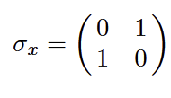
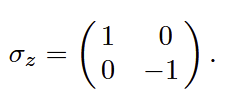
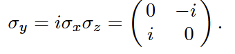
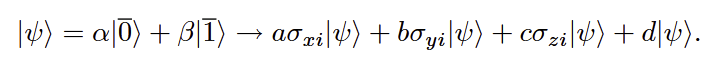
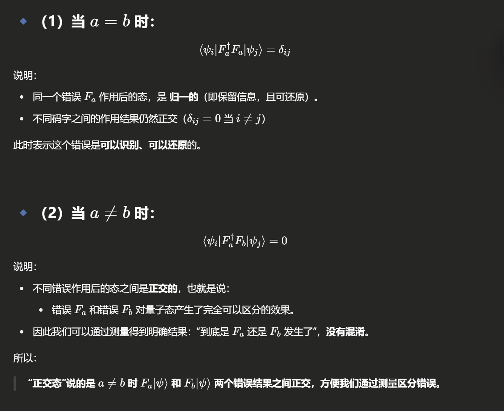

# Chapter 2 量子纠错基础

## error type

X error(翻转错误)

Z error(相位错误)

同时错误

### error的线性叠加

## 2.3 量子编码的性质

现在让我们来讨论更一般量子编码的一些性质。\
一个用于编码 $k$ 个量子比特的量子编码，在 $n$ 个量子比特上将有 $2^k$ 个基码字，对应于原始状态的基矢。任何这些基码字的线性组合也是一个有效的码字，且对应于未编码基态的相同线性组合。

有效码字的空间 $T$（即**编码空间**）因此本身构成了一个希尔伯特空间，是整个 $2^n$ 维希尔伯特空间的一个子空间。

码字是经过编码之后的量子态。

就像 Shor 的 9 比特编码一样，如果我们可以纠正错误 $E$ 和 $F$，那么也可以纠正它们的线性组合 $aE + bF$。因此，我们只需要考虑编码是否能纠正一组基本错误即可。

### 2.3.1 基本错误集

$\sigma_x$ 、$\sigma_y$、$\sigma_z$ 以及单位矩阵 $I$。

### 2.3.2 算子的权重

算子的**权重（weight）被定义为：它与单位算子不同的量子比特数目。\
所有这类张量积算子，再乘上一个可能的整体因子 $-1$ 或 $\pm i$，所形成的集合，构成了一个群 $\mathcal{G}$，在乘法下封闭。这个群在稳定子表述法**（stabilizer formalism）中起着重要作用

### 2.3.3 错误状态的区分

为了让编码能够纠正两个错误 $E_a$ 和 $E_b$，我们必须能区分：

*   $E_a$  作用在一个基码字  $|\psi_i\rangle$  上

*   和  $E_b$  作用在另一个基码字  $|\psi_j\rangle$  上

我们只有在 $E_a|\psi_i\rangle$ 和 $E_b|\psi_j\rangle$ 是**正交**的情况下，才能做到这一点；否则，总存在把它们混淆的可能性。

因此，需要满足：

$$
\langle \psi_i | E_a^\dagger E_b | \psi_j \rangle = 0 \tag{2.8}
$$

当 $i \neq j$，且 $E_a$、$E_b$ 是需要纠正的错误时。

当我们通过测量来获取错误信息时，**我们必须确保无法从测量结果中学到关于码字内部状态的信息**。\
如果学到了，就会破坏叠加态（superpositions），那么虽然能纠正基态码字，但无法纠正任意叠加态。

因此，我们需要确保：对于所有可能的错误 $E_a$、$E_b$，测量量

$$
\langle \psi_i | E_a^\dagger E_b | \psi_i \rangle
$$

对于所有基码字都是**一样的**，也就是说：

$$
\langle \psi_i | E_a^\dagger E_b | \psi_i \rangle = \langle \psi_j | E_a^\dagger E_b | \psi_j \rangle \tag{2.9}
$$

我们可以将公式（2.8）和（2.9）合并成一个更简洁的表达式：

$$
\langle \psi_i | E_a^\dagger E_b | \psi_j \rangle = C_{ab} \delta_{ij} \tag{2.10}
$$

其中：

*   $|\psi_i\rangle$ 、 $|\psi_j\rangle$  是所有基码字；

*   $E_a$ 、 $E_b$  是所有可能错误；

*   $C_{ab}$  是与  $i$ 、 $j$  无关的常数。

这个条件最早由 Knill 和 Laflamme \[16] 以及 Bennett 等人 \[17] 提出。

对于原始误差集 $\{E_a\}$，情况一般是：

$$
\langle \psi_i | E_a^\dagger E_b | \psi_j \rangle = C_{ab} \delta_{ij}
$$

这里 $C_{ab}$ 是一个复杂的（非对角的）Hermitian矩阵，可能有交叉项。

> ***Remark***

*如果在纠错过程中，你的测量操作：*

*   *不仅告诉你有没有发生错误，*
*   ***还额外泄露了码字内部的具体状态信息（比如是更偏向 $|\overline{0}\rangle$ 还是 $|\overline{1}\rangle$）***

*那么，就意味着你实际上****测量了量子信息本身****，从而：*

*   *叠加态被破坏成了某一个确定的状态；*
*   *原本的量子信息（$\alpha$、$\beta$）就丢失了；*
*   *量子计算或者量子通信的正确性就失效了！*
*

*所以正确的做法是：*

*   ***只测量错误信息****（比如“哪里出了错、出了什么错”）*

*   ***绝不能测量出编码空间内部的信息***

*   *也就是说：*

    *   *你只能区分“有没有错误”*
    *   *不能区分“原来到底是 $|\overline{0}\rangle$、$|\overline{1}\rangle$ 还是它们的叠加”*

*所以量子纠错需要保证：*

$$
\langle \psi_i | E_a^\dagger E_b | \psi_i \rangle = \langle \psi_j | E_a^\dagger E_b | \psi_j \rangle
$$

*对于所有基码字（$|\psi_i\rangle$、$|\psi_j\rangle$）来说，都一样。*

> 对$C_{ab}$的处理

***Method 1: 对角化***

不同错误的测量结果一定不同。

**如果将把矩阵 $C_{ab}$ 对角化,重新定义新的错误基 $\{F_a\}$**，使得在这个新基下 $C_{ab}$ 是对角的,我们可以得到一个新的错误基集 $\{F_a\}$，使得：

要么

$$
\langle \psi_i | F_a^\dagger F_b | \psi_j \rangle = \delta_{ab}\delta_{ij} \tag{2.11}
$$

要么

$$
\langle \psi_i | F_a^\dagger F_b | \psi_j \rangle = 0 \tag{2.12}
$$

具体取决于 $a$ 的不同。

$a \neq b$ 对应湮灭码字的错误。

***Method 2: 简并基底***（minor basis change）

找到这样一个错误基底，使得任何两个错误作用在某个给定码字上时，要么产生**正交态**，要么产生**完全相同的态**。

**湮灭码字（annihilate codewords）的错误 $F_a$，对应于作用在码字上效果相同的两个错误**。\
例如，在 Shor 的九比特编码中，$\sigma_{z1}$ 和 $\sigma_{z2}$ 在码字上的作用是相同的，因此 $\sigma_{z1} - \sigma_{z2}$ 将会湮灭所有码字。

这种现象**当且仅当**矩阵 $C_{ab}$ **不具有最大秩**（maximum rank）时才会发生。

对于 $C_{ab}$ 是奇异的（singular）的情形，我们称对应的量子码是一个**简并码（degenerate code）**；\
而对于 $C_{ab}$ 非奇异的情形，我们称该码为**非简并码（nondegenerate code）**。

Shor 的九比特码是一个**简并码**，我们后面还会看到许多这种例子。

### 2.3.4 码距

后面我们还会看到一些非简并码（nondegenerate codes）的例子。\
需要注意的是，一个码是否是简并的，取决于它要纠正的错误集合。\
例如，一个能纠正两个错误的**简并码**，当我们只将其视为纠正一个错误时，可能就变成**非简并码**了。

$ \langle \psi_i | E_a^\dagger E_b | \psi_j \rangle = C_{ab} \delta_{ij} $

在式（2.10）中，若 $E = E_a^\dagger E_b$ 属于群 $\mathcal{G}$，那么它仍然在错误群内。

对于使式（2.10）**不成立**的最小权重（weight）误差 $E \in \mathcal{G}$，我们称其为该码的**距离（distance）**。\
一个量子码如果要纠正最多 $t$ 个错误，**其距离必须至少为 $2t + 1$**。\
每个量子码的最小距离至少为 1。

> remark

### 🔶 1. 什么情况下 2.10 是成立的？

我们希望：

$$
\langle \psi_i | E_a^\dagger E_b | \psi_j \rangle = C_{ab} \delta_{ij}
$$

这表示：

*   若 $i \ne j$，内积必须为 0 → 意味着错误 $E_a$ 和 $E_b$ **不会混淆两个不同的码字**

*   若 $i = j$，只要有个常数 $C_{ab}$ 表示它们的作用影响，但无损态

这种情形下，**我们能够可靠地区分错误，恢复原始态**。

***

### 🔶 2. 什么情况下 2.10 会**不成立**？

如果某个错误 $E = E_a^\dagger E_b$ 导致：

*   $\langle \psi_i | E | \psi_j \rangle \ne 0$ 且 $i \ne j$

那么这个错误的作用会**把一个码字“误解”为另一个码字**，即：

🟥 **错误引起了码字之间的混淆 → 无法纠正 → 失效！**

我们用 $[n, k, d]$ 表示一个将 $k$ 个量子比特编码进 $n$ 个量子比特的、距离为 $d$ 的码。

注意：在文献中，一个量子码通常写作 $[[n, k, d]]$，以区别于经典码的 $[n, k, d]$ 表示法。\
本书中我选择使用 $[n, k, d]$ 是为了强调它与经典理论之间的相似性；当我需要区别对待时，我会明确使用“量子”和“经典”这两个词。

***

我们还可以考虑一些**纠错任务的变种形式**。\
例如，假设我们只希望**检测**错误是否发生，而不纠正它。

这可以用于一些例如利用量子 Zeno 效应防止错误发生的场景。\
在这种情况下，我们并不需要区分错误 $E_a$ 和其他错误 $E_b$，只需区分是否为单位算符 $I$。

这时仍然可以使用之前的方法导出公式（2.10），只不过这时我们令 $E_b = I$。\
于是我们得到：一个能够检测 $s$ 个错误的码，其距离至少需要为 $s + 1$。

> Remark: 从汉明球和汉明距离的角度理解。
>
> | 距离 $d$ | 能力 |
> | ------ | -- |
>
>
> | <!-- --> | <!-- --> |
> | ------------------------------------------------------ | -- |
> | $d$ 可纠正 $\left\lfloor \frac{d-1}{2} \right\rfloor$ 个错误 | 纠正 |
>
>
> | <!-- --> | <!-- --> |
> | ------------------- | -- |
> | $d$ 可检测最多 $d-1$ 个错误 | 检测 |
>

***

另一个变种是：我们知道错误发生在某个已知的位置（例如，在量子擦除信道中）。\
这时，我们只需要区分那些**作用在同一位置**的错误即可。

这意味着：对于作用在同一位置的错误 $E_a, E_b$，有 $E_a^\dagger E_b$ 的权重与 $E_a$ 相同。\
因此，为了纠正 $r$ 个已知位置的错误，一个码的距离至少要为 $r + 1$。

> Remark:
>
> | 情况             | 特点                           | 对距离要求       |
> | -------------- | ---------------------------- | ----------- |
> | 未知位置错误（普通量子纠错） | 不知道哪一位错了，需要同时找到“哪里错了”和“错了什么” | 距离至少 $2t+1$ |
> | 已知位置错误（比如擦除错误） | 已经知道哪一位错了，只需要判断“错了什么”并修复     | 距离只要 $r+1$  |
>

我们还可以将这些任务结合起来考虑：

*   若要纠正  $t$  个任意错误、

*   另外  $r$  个**已知位置错误**、

*   并检测  $s$  个其他错误，

则我们所需的码距离必须至少为：

$$
r + s + 2t + 1
$$

> Remark:
>
> 只需要**一次性的全局加 1**，而不是每个部分单独加 1。

## 2.4 Error Models

在本论文中，我主要假设错误在不同量子比特上**独立发生**，\
并且当一个量子比特发生错误时，它同样有可能是 $\sigma_x$、$\sigma_y$ 或 $\sigma_z$ 类型的错误。

如果每个量子比特发生错误的概率 $\epsilon$ 相当小，\
那么通常可以**忽略超过 $t$ 个错误同时发生的可能性**，因为这种情况的概率仅是 $O(\epsilon^{t+1})$ 量级。

因此，我通常只处理**能够纠正最多 $t$ 个任意错误**的量子码。\
这样的编码可以处理最多 $t$ 个量子比特上出现的任意错误，\
即使这些错误使得数据仍处于正常的计算空间内（尽管可能被移出了有效码字空间）。

### 2.4.1 泄露错误

在某些系统中，可能会出现**错误使系统跳出计算空间**的情况。\
例如：

*   如果数据被存储在离子（ion）的基态或亚稳激发态中，
*   那么电子可能跳跃到另一个不同的激发态。

又比如：

*   如果数据被存储在光子的偏振态中，
*   光子可能会逃逸（即离开系统）。

在这两种情况下，常规的错误纠正网络将无法正常工作，\
因为它们**假设量子比特始终处于 $|0\rangle$ 或 $|1\rangle$ 的状态内。（没有发生量子泄露的情况下）**

然而，通过执行一些**能够区分计算希尔伯特空间与其他可能态的测量**，\
我们可以确定系统是否仍停留在有效计算空间中。

不仅需要检测出这种**泄漏错误（leakage error）已经发生，\
还需要确定发生在了哪个量子比特上**。

一旦确定了泄漏错误的位置，我们就可以：

*   将原子冷却到基态，或者
*   引入一个新的具有随机极化的光子，

从而将这个泄漏错误转化为一个**已知位置的错误（located error）**，\
这正是上一节末尾讨论过的情形。

检测泄漏错误的一种可能门控网络如图 2.1 所示（具体符号的说明见附录 A 和后续图示）。

\
(<a href="zotero://select/library/items/PAPMSC88">Gottesman, 1997, p. 16</a>)

这个网络假设：

*   处于计算空间外的态不会与其他量子比特发生任何相互作用。

具体过程是：

*   如果数据比特的状态  $|\psi\rangle$  是  $|0\rangle$  或  $|1\rangle$ ，\
    那么辅助比特（ancilla qubit）经过操作后会翻转成  $|1\rangle$ 。

*   如果数据比特的状态既不是  $|0\rangle$  也不是  $|1\rangle$ ，\
    那么辅助比特将保持在  $|0\rangle$ ，

这样，我们就可以通过辅助比特是否翻转来**检测该数据比特是否发生了泄漏错误**。

### 2.4.2多量子比特的相关错误

另一种可能的困难是：多量子比特的相关错误（correlated errors）可能发生。

> Remark : 相关错误
>
> **多个量子比特的错误不是独立发生的**，而是互相牵连、同时出问题。

虽然从原则上讲这会是一个严重问题，\
但只要相关错误的概率**随着错误块的大小足够快地下降**，\
形式上的处理方法就不需要改变。

因为：

*   单个量子比特上不相关错误（uncorrelated errors）的概率是  $O(\epsilon)$ ，

*   那么  $t$  个比特上的错误概率是  $O(\epsilon^t)$ ，

*   只要  $t$  个量子比特的**相关错误**的概率也是  $O(\epsilon^t)$ ，

那么相关错误就不会带来新的问题。

***

在实际系统中，假设错误以 $\sigma_x$、$\sigma_y$、$\sigma_z$ 三种泡利误差同等可能地发生，其实并不现实。\
实际上，某些 $\sigma_x$、$\sigma_y$、$\sigma_z$ 的线性组合会更常见。

例如：

*   当量子比特是离子的基态或激发态时，
*   常见的错误来源是**自发发射（spontaneous emission）**。

经过一段时间后：

*   激发态可能衰减到基态，

*   产生误差  $\sigma_x + i\sigma_y$  的概率是  $\epsilon$ ，

*   或者保持在原状态，改变  $|0\rangle$  和  $|1\rangle$  的相对幅度，

*   产生误差  $I - \sigma_z$ ，其概率是  $O(\epsilon^2)$ 。

这种时间演化过程对应一个所谓的**振幅衰减信道（amplitude damping channel）**。

由于时间演化的 $O(1)$ 效应接近单位算符 $I$，\
所以这种错误可以通过**将最低能量状态映射到 $|0\rangle$** 的方式进行保护，\
并且能够纠正任意单比特错误。

不过，如果能够根据实际中错误出现的受限模式进行优化设计，\
那么纠错码的效率可以比需要纠正任意错误的通用量子码更高。\
理解哪些物理机制是导致错误的主要来源，\
无疑将是未来**工程化量子计算机**时的重要一环。
