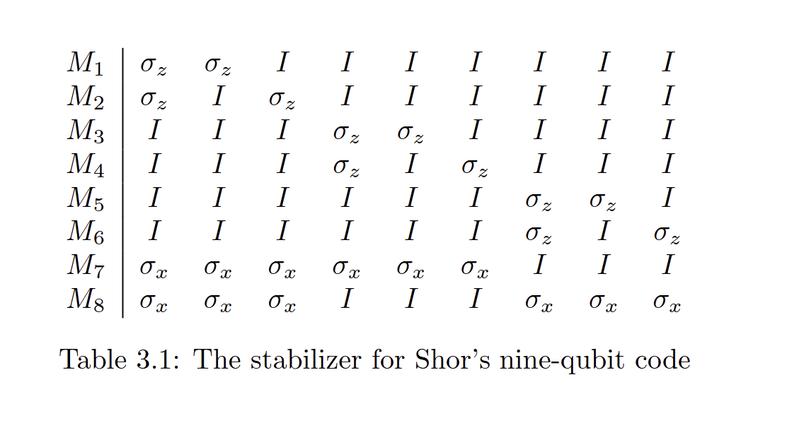
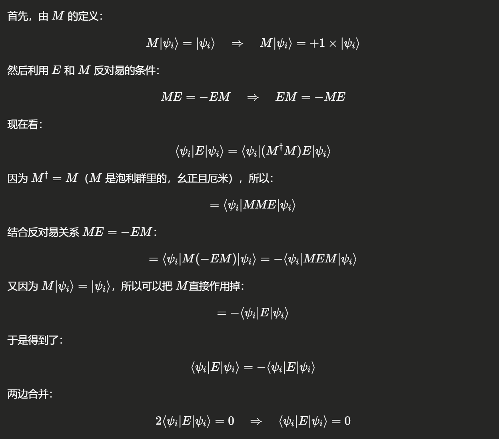
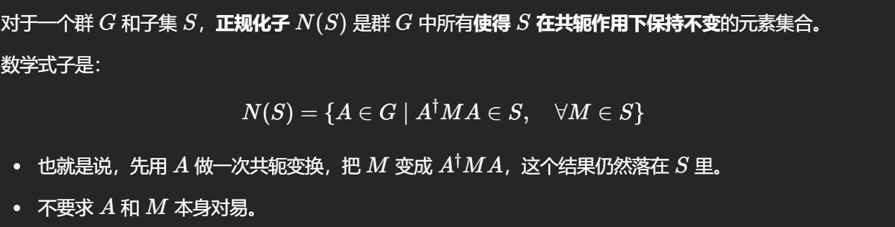

# Chapter 3: Stabilizer Coding

## 3.1 九比特码的再探（The Nine-Qubit Code Revisited）

让我们更仔细地看看，我们之前用于纠正九比特码错误的过程。

要检测前三个量子比特中的某一个发生了比特翻转错误（bit flip error），\
我们需要比较**第一个和第二个量子比特**、以及**第一个和第三个量子比特**。

这等价于测量算符 $\sigma_{z1} \sigma_{z2}$ 和 $\sigma_{z1} \sigma_{z3}$ 的本征值（eigenvalue）：

*   如果第一个和第二个比特的状态相同，那么  $\sigma_{z1} \sigma_{z2}$  的本征值是  $+1$ ；

*   如果不同，那么本征值是  $-1$ 。

类似地，要检测符号错误（sign error），\
我们需要比较：

*   第一组三个比特与第二组三个比特的符号，
*   以及第一组与第三组三个比特的符号。

这等价于测量算符 $\sigma_{x1}\sigma_{x2}\sigma_{x3}\sigma_{x4}\sigma_{x5}\sigma_{x6}$\
和 $\sigma_{x1}\sigma_{x2}\sigma_{x3}\sigma_{x7}\sigma_{x8}\sigma_{x9}$ 的本征值：

*   如果符号一致，本征值是  $+1$ ；

*   如果符号不同，本征值是  $-1$ 。

为了**完全纠正**编码中的错误，\
我们需要测量**总共8个算符**的本征值，\
这些算符列在表 3.1 中。

***

### 稳定子和生成元

在 Shor 码中，有两个有效的编码码字（codeword）$|\overline{0}\rangle$ 和 $|\overline{1}\rangle$，\
它们都是这八个算符的本征向量，且对应的本征值均为 $+1$。

在群 $G$ 中，所有固定住 $|\overline{0}\rangle$ 和 $|\overline{1}\rangle$ 的算符，都可以通过这八个算符的乘积来表达。固定住 $|\overline{0}\rangle$ 和 $|\overline{1}\rangle$ 的这些算符集合，\
形成一个群 $S$，称为**编码的稳定子（stabilizer）**。

> remark: 稳定子表示一种测量

而表 3.1 中的 $M_1$ 到 $M_8$ 就是这个稳定子群的**生成元（generators）**。

***

当我们测量 $M_1$ 的本征值时，\
实际上是在检测是否有比特翻转错误发生。

如果在第一个或第二个量子比特上发生了错误（即，发生了 $\sigma_{x1}$ 或 $\sigma_{x2}$），\
那么需要注意的是：

*   这两种错误都会**反对易（anticommute）**于  $M_1$ ，

*   而从  $\sigma_{x3}$  到  $\sigma_{x9}$  的错误，则与  $M_1$  **对易（commute）**，因此仅靠测量  $M_1$  是无法检测到它们的。

> Remark : 对易和反对易
>
> 在量子力学和量子信息中，给定两个算符 $A$ 和 $B$，我们说：
>
> *   **对易（commute）**，如果：
>
>     $$
>     AB = BA
>     $$
>
>     即，先做 $A$ 再做 $B$，跟先做 $B$ 再做 $A$ 是完全一样的，不管顺序。
>
> *   **反对易（anticommute）**，如果：
>
>     $$
>     AB = -BA
>     $$
>
>     即，先做 $A$ 再做 $B$，和先做 $B$ 再做 $A$ 差了一个负号。
>
> 它们之间满足：
>
> *   $\sigma_x \sigma_y = i \sigma_z$，而且 $\sigma_y \sigma_x = -i \sigma_z$，所以：
>
>     $$
>     \sigma_x \sigma_y = -\sigma_y \sigma_x
>     $$
>
>     → $\sigma_x$ 和 $\sigma_y$ **反对易**。
>
> *   同样地，$\sigma_x$ 和 $\sigma_z$ 也反对易：
>
>     $$
>     \sigma_x \sigma_z = -\sigma_z \sigma_x
>     $$
>
> *   但是 $\sigma_x$ 和 $\sigma_x$ 自己当然是对易的：
>
>     $$
>     \sigma_x \sigma_x = \sigma_x \sigma_x
>     $$
>
> 如果一个错误 $E$ 和一个稳定子 $M$ **对易**（$EM = ME$）：
>
> *   测量  $M$  的本征值不会因为  $E$  而改变；
>
> *   所以这个错误  $E$  可能不会被这个  $M$  发现。
>
> 如果一个错误 $E$ 和一个稳定子 $M$ **反对易**（$EM = -ME$）：
>
> *   测量  $M$  的本征值会因为  $E$  而翻转；
>
> *   比如原来是  $+1$ ，现在变成了  $-1$ ，所以检测到异常。
>
> $\sigma_x$  和 $\sigma_z$ 是**反对易**的（$\sigma_x \sigma_z = -\sigma_z \sigma_x$）
>
> $\sigma_x$ 和 $I$ 是**对易**的（$\sigma_x I = I \sigma_x$）

同样地：

*   $M_2$  可以检测到  $\sigma_{x1}$  或  $\sigma_{x3}$  这两种错误，因为它们与  $M_2$  反对易；

*   $M_7$  则可以检测  $\sigma_{z1}$  到  $\sigma_{z6}$  的错误。

一般来说，如果 $M \in S$（$S$ 是稳定子群），且 $\{M, E\} = 0$（即 $M$ 与 $E$ 反对易），并且 $|\psi\rangle \in T$（$T$ 是编码空间），那么有：

$$
ME|\psi\rangle = -EM|\psi\rangle = -E|\psi\rangle \tag{3.1}
$$

因此，$E|\psi\rangle$ 是 $M$ 的本征向量，其本征值是 $-1$ 而不是 $+1$。\
所以，要检测错误 $E$，我们只需要测量算符 $M$。

> remark
>
> ## 情况1：M 和 E **对易**（ME = EM）
>
> 推导：
>
> $$
> M(E|\psi\rangle) = E(M|\psi\rangle) = E(+|\psi\rangle) = +(E|\psi\rangle)
> $$
>
> 所以测量稳定子仍然得到 $+1$
>
> ## 情况2：M 和 E **反对易**（ME = -EM）
>
> 推导：
>
> $$
> M(E|\psi\rangle) = -E(M|\psi\rangle) = -(E(+|\psi\rangle)) = -(E|\psi\rangle)
> $$
>
> 所以测量稳定子得到的是 $-1$

实际上，这个码的距离（distance）是**3**。

只要稍微检查一下就可以发现：

*   任何单比特算符（如  $\sigma_{xi}$ 、 $\sigma_{yi}$ 、 $\sigma_{zi}$ ）都会与  $M_1$  到  $M_8$  中的某个算符反对易。

由于具有不同本征值的态是正交的，\
所以当 $E_a$ 的权重是1且 $E_b = I$ 时，满足条件（2.10）。

> Remark:
>
> 权重（weight）指的是算符作用在多少个量子比特上。$E_a$ 权重是1：说明 $E_a$ 只对一个量子比特作用，比如一个 $\sigma_x$、$\sigma_y$、$\sigma_z$。
>
> 发生一个单比特错误 $E_a$ 后，与什么都没发生（$E_b = I$）的态进行比较时，如果 $E_a$ 能把编码态的本征值从 $+1$ 变成 $-1$（因为 $E_a$ 与某些稳定子反对易），那么出错后的态和正常态会属于不同的本征值空间，因此它们是正交的,**所以条件（2.10）自动满足。**

我们还可以验证：

*   任何双比特算符  $E$  通常也会与某个  $S$  中的元素反对易，

*   除了那种特定形式的： $\sigma_{za}\sigma_{zb}$ ，其中  $a$  和  $b$  处于同一个三比特块中。

不过，这种形式的算符实际上属于稳定子群内部。\
这意味着对于任何编码态 $|\psi\rangle$，都有：

$$
\sigma_{za}\sigma_{zb}|\psi\rangle = |\psi\rangle
$$

并且：

$$
\langle \psi | \sigma_{za}\sigma_{zb} | \psi \rangle = \langle \psi | \psi \rangle = 1
$$

因此，这类算符也满足条件（2.10）。

因为 $\sigma_{za}\sigma_{zb}$ 本身就在稳定子群中，所以 $\sigma_{za}$ 和 $\sigma_{zb}$ 在编码态上作用是一样的，\
我们不需要区分它们。**只要一个错误组合本身就在稳定子群内部，它就不会破坏编码态，因此无需检测和纠正。**

> Remark:\
> **稳定子群的定义**就是所有把编码态 $|\psi\rangle$ 保持不变（或者只是加一个整体相位，比如 $+1$）的泡利算符组合。
>
> 1.  如果一个错误 $E$ 本身就在稳定子群里（比如 $\sigma_{za} \sigma_{zb}$ 这种），\
>     那么它作用到编码态上：
>
>     $$
>     E|\psi\rangle = |\psi\rangle
>     $$
>
>     根本就**没有真正改变编码态**。
>
> 2.  因此，虽然数学上发生了  $E$  这个操作，但物理上——对于编码态来说——它**就像什么都没发生一样**！
>
> 3.  所以, **这不是一个需要纠正的错误**，**也不需要特意去区分 $\sigma_{za}$ 和 $\sigma_{zb}$ 的不同影响**。

然而，当我们检查**权重为3**的算符时，就能发现一些违反条件（2.10）的例子。

例如，算符 $\sigma_{x1}\sigma_{x2}\sigma_{x3}$：

*   它与  $S$  中的所有稳定子算符都是对易的，

*   但是它在两个不同编码态上的期望值不同：

$$
\langle 0|\sigma_{x1}\sigma_{x2}\sigma_{x3}|0\rangle = +1 \tag{3.2}
$$

$$
\langle 1|\sigma_{x1}\sigma_{x2}\sigma_{x3}|1\rangle = -1 \tag{3.3}
$$

***

这意味着虽然 $\sigma_{x1}\sigma_{x2}\sigma_{x3}$ 不破坏稳定子关系（对易，如果错误算符 $E$ 和稳定子 $M$ 对易，那么测量 $M$ 后仍然得到 $+1$，说明稳定子关系没破坏。），但它却能把编码的 $|0\rangle$ 和 $|1\rangle$ 搞得不再一致（产生了区分），因此需要特别小心。

> 我们希望逻辑的$|\overline{0}\rangle$和$|\overline{1}\rangle$编码态尽可能“隐形”，也就是说任何稳定子内部的变化都不能区分它们。一旦有某个错误能**把$|\overline{0}\rangle$和$|\overline{1}\rangle$区分开来**，比如某个操作让$|\overline{0}\rangle$得+1，$|\overline{1}\rangle$得-1，那么这个错误相当于**在逻辑层面对量子信息造成了破坏**！

## 3.2 通用稳定子码（The General Stabilizer Code）

### 3.2.1 群论

一个群（Group）是一组元素，配合一个运算（比如乘法），满足：

*   封闭性（Closure）
*   结合律（Associativity）
*   单位元存在（Identity）
*   逆元存在（Inverse）

**阿贝尔群（Abelian Group）**

阿贝尔群是**一种特别的群**，\
它**额外**满足一条**交换律（Commutative Law）**：

对任意两个元素 $a, b$ 都有：

*

    $$
    ab = ba
    $$
    
    换句话说：运算顺序**可以交换**，结果一样。

### 3.2.2 稳定子构造

稳定子构造方法适用于远不止九比特编码 \[21, 22]。一般而言，稳定子 $S$ 是群 $\mathcal{G}$ 的一个阿贝尔（Abelian）子群，而编码空间 $T$ 是被 $S$ 固定不变的向量空间。由于 $\sigma_y$ 带有虚部，而 $\sigma_x$ 和 $\sigma_z$ 是实的，如果每个稳定子元素中出现 $\sigma_y$ 的数量为偶数，那么基态码字的所有系数都可以选为实数；如果 $\sigma_y$ 的数量是奇数，那么它们可能是虚数。然而，Rains 证明了，只要存在一个（可能是复数形式的）码，就一定存在一个具有相同参数的实数码 \[23]。因此，本文主要关注实数码。

为了在 $n$ 个物理比特中编码 $k$ 个逻辑比特，编码空间 $T$ 需具有 $2^k$ 个维度，而稳定子群 $S$ 必须包含 $2^{n-k}$ 个元素。\[1] $S$ 必须是阿贝尔群，因为只有彼此对易的算符才能拥有共同的本征向量。同时，需要保证 $S$ 是阿贝尔群且其中不包含 $i$ 或 $-1$，那么定义为

$$
T = \{|\psi\rangle \,\text{使得}\, M|\psi\rangle = |\psi\rangle \,\, \forall M \in S\}
$$

的空间 $T$ 将具有维度 $2^k$。

> Remark：
>
> \[1] 物理系统有 $n$ 个比特，所以整体希尔伯特空间维度是 $2^n$,稳定子码的编码空间 $T$ 是那些被稳定子群 $S$ 中所有元素固定不变的态组成的子空间。稳定子的作用就是**把原本大的空间 "切" 成一个小子空间**，而这个子空间要能够容纳 $k$ 个逻辑比特，因此要求：
>
> $dim(T)=2^k$
>
> 1.  **每加一个独立的稳定子生成元，就把空间缩小一半。**
>
>     *   为什么？因为稳定子  $M$  的本征值只有  $+1$  和  $-1$  两种。
>
>     *   要求  $M|\psi\rangle = +|\psi\rangle$ ，意味着在  $M$  的两个本征空间中，只保留了  $+1$  对应的一半态。
>
>     *   每加一个独立的稳定子条件，空间维度就减半一次。
>
> 2.  **如果有 $m$ 个独立的稳定子生成元**，那么编码子空间的维度是：
>
> $$
> 2^n \times \left(\frac{1}{2}\right)^m = 2^{n-m}
> $$
>
> 要求最终子空间维度是 $2^k$，所以必须满足：
>
> $$
> 2^{n-m} = 2^k
> \quad \Rightarrow \quad
> m = n - k
> $$
>
> 也就是说，需要 $n-k$ 个独立的稳定子生成元。

在这里，有必要列举一些关于群 $\mathcal{G}$ 的性质。由于

$$
\sigma_x^2 = \sigma_y^2 = \sigma_z^2 = +1,
$$

群中每个元素的平方都等于 $\pm 1$。此外，**在同一个比特上，$\sigma_x$、$\sigma_y$、$\sigma_z$ 彼此反对易；而在不同的比特上，它们是对易的**。因此，群 $\mathcal{G}$ 中任意两个元素要么对易，要么反对易。而且，$\sigma_x$、$\sigma_y$、$\sigma_z$ 都是Hermitian矩阵。当然，$iT^{\dagger}$$=-iI$，所以群 $\mathcal{G}$ 中的元素可以是厄米（Hermitian）或反厄米（anti-Hermitian）的。在任何情况下，如果 $A \in \mathcal{G}$，那么 $A^\dagger$ 也属于 $\mathcal{G}$。同样，$\sigma_x$、$\sigma_y$、$\sigma_z$ 都是幺正（unitary）的，因此 $\mathcal{G}$ 中的每个元素都是幺正算符。

如前所述，如果 $M \in S$，$|\psi_i\rangle \in T$，且 $\{M, E\} = 0$(反对易)，那么：

$$
M E |\psi_i\rangle = - E M |\psi_i\rangle = - E |\psi_i\rangle
$$

所以，

$$
\langle \psi_i | E | \psi_j \rangle = \langle \psi_i | M E | \psi_j \rangle = -\langle \psi_i | E | \psi_j \rangle = 0
\tag{3.4}
$$

因此，当 $E = E_a^\dagger E_b = \pm E_a E_b$ 与某个 $M \in S$ 反对易时，码满足等式 (2.8)。实际上，在这种情况下也满足 (2.9)，因为：

$$
\langle \psi_i | E | \psi_i \rangle = \langle \psi_j | E | \psi_j \rangle = 0
$$

因此，如果 $E_a^\dagger E_b$ 与某些集合中的所有稳定子元素 $M$ 反对易，那么码能够纠正这组错误。\[1]

> Remark:
>
> \[1]
>
> $E = E_a^\dagger E_b = \pm E_a E_b$
>
> 1.  $E$  与某个稳定子  $M \in S$  反对易： $\{M, E\} = 0$
>
> 2.  $|\psi_i\rangle \in T$ ，即稳定子空间，满足  $M|\psi_i\rangle = |\psi_i\rangle$
>
> 

当然，严格来说，这种情况通常不会发生。通常，$I$ 加上一个允许的错误 $E$，并且 $E = iT$ 会与所有东西对易。然而，因为 $S$ 是一个群，所以如果 $E \in S$，则

$$
\langle \psi_i | E | \psi_j \rangle = \langle \psi_i | \psi_j \rangle = \delta_{ij}
$$

（式 3.5）

这也将满足等式 (2.10)。

***

### 3.2.3 中心化子和正规化子

现在，一般而言，在 $\mathcal{G}$ 中有许多元素与 $S$ 中的一切都对易，但本身不属于 $S$。与 **$S$ 中所有元素对易的元素集合**被定义为 $S$ 在 $\mathcal{G}$ 中的**中心化子**（centralizer）$C(S)$。

由于 $S$ 和 $\mathcal{G}$ 的性质，这个中心化子实际上等于 $S$ 在 $\mathcal{G}$ 中的**正规化子**（normalizer）$N(S)$，其中正规化子被定义为使 $S$ 在共轭下保持不变的元素集合。

为理解这一点，注意，对于任何 $A \in \mathcal{G}$、$M \in S$，有：

$$
A^\dagger M A = \pm A^\dagger A M = \pm M
$$

（式 3.6）

因为 $-1$ 不属于 $S$，所以当且仅当 $A \in C(S)$ 时，$A$ 属于 $N(S)$。因此，$N(S) = C(S)$。注意，$S \subseteq N(S)$。

实际上，$S$ 是 $N(S)$ 的一个正规子群（normal subgroup）。$N(S)$ 包含 $4 \times 2^{n+k}$ 个元素。这个 $4$ 倍因子来源于整体相位（overall phase）的自由选择。

因为整体相位对物理量子态通常没有影响，所以在考虑 $N(S)$ 时，通常忽略这一整体相位因子。

***

如果 $E \in N(S) - S$，那么 $E$ 会重新排列 $T$ 中的元素，但不会将它们移出 $T$。即，如果 $M \in S$ 且 $|\psi\rangle \in T$，则

$$
M E |\psi\rangle = E M |\psi\rangle = E |\psi\rangle
$$

（式 3.7）

所以 $E|\psi\rangle$ 也属于 $T$。

由于 $E \notin S$，存在某个 $T$ 中的态不是被 $E$ 固定的。除非 $E$ 仅与某个 $S$ 中元素相差一个整体相位，否则 $E$ 将是该码无法探测到的错误。

### 3.3.4 简并码和非简并码

1.  简并码是一个平面，确定简并码后，一些错误作用在这个简并码上，仍然得到简并码，因此，称这些错误是简并的。
2.  非简并码是一个平面

综合以上讨论，我们可以说，具有稳定子 S 的量子码将检测所有满足以下条件的错误 E：

- E 要么属于 S，
- 要么与 S 中的某个元素反对易。

换句话说，就是：
$$
E \in S \cup (G - N(S))
$$
这个量子码可以纠正一组错误 $\{E_i\}$，当且仅当对于任意 EaE_aEa、EbE_bEb，有：

$$
E_a^\dagger E_b \in S \cup (G - N(S))
$$
（注意：$E_a^\dagger E_b$ 与某个 $M \in G$ 对易，当且仅当$E_a^\dagger E_b = \pm E_a^\dagger E_b$。）

例如，若量子码的距离为 d，则当且仅当 $N(S) - S$ 中没有权重小于 d 的元素时成立。

如果稳定子群 S 中有权重小于 d 的元素（除了单位元），那么这个码就是**简并的**（degenerate）；否则，它就是**非简并的**（nondegenerate）码。

例如，九比特码（即 Shor 码）是一个简并码，因为它的距离是三，同时 $S\sigma_{z1}\sigma_{z2} \in S$。

对于一个非简并的稳定子码，有：

$$
\langle \psi_i | E_a^\dagger E_b | \psi_j \rangle = \delta_{ab} \delta_{ij} \quad \text{(式 3.8)}
$$

------

按照惯例，$[n, 0, d]$ 型量子码必须是非简并的。

当 $E_a, E_b \in S$时，我们称这两个错误是简并的（degenerate）， 因为在编码态上，它们的作用效果无法区分。 （实际上我们也无需区分，因为它们对编码态的影响是一样的。）

------

有时候，我们引入**错误综合症（error syndrome）**的概念会很有用。
 定义映射：

$$
f_M : G \to \mathbb{Z}_2
$$
其中：

$$
f_M(E) = \begin{cases} 0 & \text{如果 } [M, E] = 0 \\ 1 & \text{如果 } \{M, E\} = 0 \end{cases} \quad \text{(式 3.9)}
$$
然后定义一个综合症向量：

$$
f(E) = (f_{M_1}(E), \ldots, f_{M_{n-k}}(E))
$$
其中 $M_1, \ldots, M_{n-k}$ 是稳定子生成元。

于是，$f(E)$ 是一个 $n-k$ 位的二进制串，它在且仅在 $E \in N(S)$ 时为全零。

对于非简并码来说：

- 如果 $f(E_a) = f(E_b)$，那么一定有 $E_a^\dagger E_b = 0$；
- 所以，每一个可纠正错误 EEE 都对应唯一的综合症 $f(E)$。

------

为了执行一个稳定子码的**纠错操作**，我们只需要：

- 测量每个稳定子生成元的本征值，
- 这个本征值是：

$$
(-1)^{f_{M_i}(E)}
$$

- 这样测量得到的就是**错误综合症**。

**错误综合症**告诉我们具体发生了什么错误（对于非简并码）， 或者告诉我们属于哪一类简并错误（对于简并码）。

因为错误总是在群 G\mathcal{G}G 中，所以所有操作都是幺正的（unitary），可逆的。

接下来我们要做的，就是应用纠错操作（或者说乘以稳定子群 SSS 中的元素）来恢复量子态。

**注意：**即使实际发生的错误是多个错误的组合，综合症测量的过程也会将错误投影到某一个基础错误上。

如果投影后不是可纠正的状态，就会导致失败； 如果是，则恢复成功。

（第5章将描述如何测量错误综合症的现实方案，包括考虑测量的不完美性。）

由于正规化子$N(S)$ 中的元素会在编码子空间 T 内部移动编码态，
 它们可以被自然地解释为**作用在编码字上的逻辑操作**。

因为稳定子群 S 固定了 T，
 实际上，**只有 N(S)/S** 会在 TTT 上产生**非平凡的作用**。

如果我们为 T 选取一组**由 N(S) 中的 k 个对易元素组成的本征矢**作为基底，
 那么我们可以得到一个从 $N(S)/S$ 到 $G_k$（某个群）的自同构（automorphism）。

因此，$N(S)/S$可以由 i 生成（后续我们将基本忽略这一点），
 并且对应 2k2k2k 个等价类。

我将用 X‾i\overline{X}_iXi、Z‾i\overline{Z}_iZi（i=1,…,ki=1,\dots,ki=1,…,k）来表示这些等价类，
 其中：

- X‾i\overline{X}_iXi 在 GkG_kGk 中映射到物理泡利算符 σxi\sigma_{x_i}σxi，
- Z‾i\overline{Z}_iZi 在 GkG_kGk 中映射到 σzi\sigma_{z_i}σzi。

它们分别是量子码对应的**编码版**的 σx\sigma_xσx 和 σz\sigma_zσz 操作。

如果 k=1k=1k=1（即编码一个逻辑比特），
 我将简单地写作：

X‾1=X‾,Z‾1=Z‾\overline{X}_1 = \overline{X}, \quad \overline{Z}_1 = \overline{Z}X1=X,Z1=Z

这些编码算符满足：

[X‾i,X‾j]=0(3.10)[\overline{X}_i, \overline{X}_j] = 0 \tag{3.10}[Xi,Xj]=0(3.10)[Z‾i,Z‾j]=0(3.11)[\overline{Z}_i, \overline{Z}_j] = 0 \tag{3.11}[Zi,Zj]=0(3.11)[X‾i,Z‾j]=0(i≠j)(3.12)[\overline{X}_i, \overline{Z}_j] = 0 \quad (i\neq j) \tag{3.12}[Xi,Zj]=0(i=j)(3.12){X‾i,Z‾i}=0(3.13)\{\overline{X}_i, \overline{Z}_i\} = 0 \tag{3.13}{Xi,Zi}=0(3.13)

其中：

- 方括号 [A,B][A,B][A,B] 表示对易子（即 AB−BAAB-BAAB−BA）；
- 花括号 {A,B}\{A,B\}{A,B} 表示反对易子（即 AB+BAAB+BAAB+BA）。

✅

------

# 📘 第二段（五比特码 5-qubit code 稳定子表）

表3.2展示了**五比特码（Five-qubit code）**的稳定子。

具体如下：

|                 |              |              |              |              |              |
| --------------- | ------------ | ------------ | ------------ | ------------ | ------------ |
| M1M_1M1         | σx\sigma_xσx | σx\sigma_xσx | σz\sigma_zσz | σx\sigma_xσx | III          |
| M2M_2M2         | III          | σx\sigma_xσx | σx\sigma_xσx | σz\sigma_zσz | σx\sigma_xσx |
| M3M_3M3         | σx\sigma_xσx | III          | σx\sigma_xσx | σx\sigma_xσx | σz\sigma_zσz |
| M4M_4M4         | σz\sigma_zσz | σx\sigma_xσx | III          | σx\sigma_xσx | σx\sigma_xσx |
| \hline          |              |              |              |              |              |
| X‾\overline{X}X | σx\sigma_xσx | σx\sigma_xσx | σx\sigma_xσx | σx\sigma_xσx | σx\sigma_xσx |
| Z‾\overline{Z}Z | σz\sigma_zσz | σz\sigma_zσz | σz\sigma_zσz | σz\sigma_zσz | σz\sigma_zσz |

表3.2：五比特码（5-qubit code）的稳定子群和逻辑操作。
