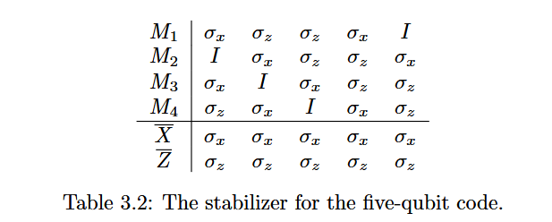
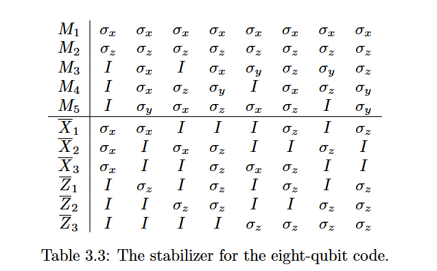
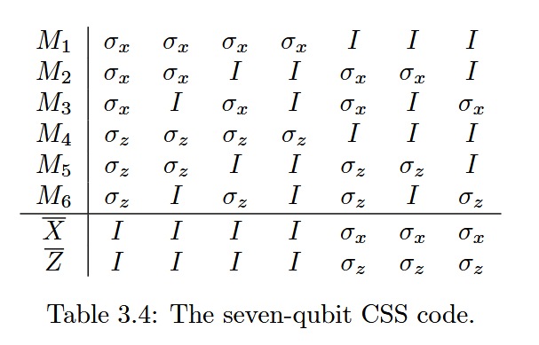

# Chapter 3: Stabilizer Coding

## 3.1 九比特码的再探（The Nine-Qubit Code Revisited）

让我们更仔细地看看，我们之前用于纠正九比特码错误的过程。

要检测前三个量子比特中的某一个发生了比特翻转错误（bit flip error），
我们需要比较**第一个和第二个量子比特**、以及**第一个和第三个量子比特**。

这等价于测量算符 $\sigma_{z1} \sigma_{z2}$ 和 $\sigma_{z1} \sigma_{z3}$ 的本征值（eigenvalue）：

*   如果第一个和第二个比特的状态相同，那么  $\sigma_{z1} \sigma_{z2}$  的本征值是  $+1$ ；

*   如果不同，那么本征值是  $-1$ 。

类似地，要检测符号错误（sign error），我们需要比较：

*   第一组三个比特与第二组三个比特的符号，
*   以及第一组与第三组三个比特的符号。

这等价于测量算符 $\sigma_{x1}\sigma_{x2}\sigma_{x3}\sigma_{x4}\sigma_{x5}\sigma_{x6}$和 $\sigma_{x1}\sigma_{x2}\sigma_{x3}\sigma_{x7}\sigma_{x8}\sigma_{x9}$ 的本征值：

*   如果符号一致，本征值是  $+1$ ；

*   如果符号不同，本征值是  $-1$ 。

为了**完全纠正**编码中的错误，我们需要测量**总共8个算符**的本征值，这些算符列在表 3.1 中。

***

### 稳定子和生成元

在 Shor 码中，有两个有效的编码码字（codeword）$|\overline{0}\rangle$ 和 $|\overline{1}\rangle$，它们都是这八个算符的本征向量，且对应的本征值均为 $+1$。

在群 $G$ 中，所有固定住 $|\overline{0}\rangle$ 和 $|\overline{1}\rangle$ 的算符，都可以通过这八个算符的乘积来表达。固定住 $|\overline{0}\rangle$ 和 $|\overline{1}\rangle$ 的这些算符集合，形成一个群 $S$，称为**编码的稳定子（stabilizer）**。

> remark: 稳定子表示一种测量

而表 3.1 中的 $M_1$ 到 $M_8$ 就是这个稳定子群的**生成元（generators）**。当我们测量 $M_1$ 的本征值时，实际上是在检测是否有比特翻转错误发生。

如果在第一个或第二个量子比特上发生了错误（即，发生了 $\sigma_{x1}$ 或 $\sigma_{x2}$），那么需要注意的是：

*   这两种错误都会**反对易（anticommute）**于  $M_1$ ，

*   而从  $\sigma_{x3}$  到  $\sigma_{x9}$  的错误，则与  $M_1$  **对易（commute）**，因此仅靠测量  $M_1$  是无法检测到它们的。

> Remark : 对易和反对易
>
> 在量子力学和量子信息中，给定两个算符 $A$ 和 $B$，我们说：
>
> *   **对易（commute）**，如果：
>
>     $$
>     AB = BA
>     $$
>
>     即，先做 $A$ 再做 $B$，跟先做 $B$ 再做 $A$ 是完全一样的，不管顺序。
>
> *   **反对易（anticommute）**，如果：
>
>     $$
>     AB = -BA
>     $$
>
>     即，先做 $A$ 再做 $B$，和先做 $B$ 再做 $A$ 差了一个负号。
>
> 它们之间满足：
>
> *   $\sigma_x \sigma_y = i \sigma_z$，而且 $\sigma_y \sigma_x = -i \sigma_z$，所以：
>
>     $$
>     \sigma_x \sigma_y = -\sigma_y \sigma_x
>     $$
>
>     → $\sigma_x$ 和 $\sigma_y$ **反对易**。
>
> *   同样地，$\sigma_x$ 和 $\sigma_z$ 也反对易：
>
>     $$
>     \sigma_x \sigma_z = -\sigma_z \sigma_x
>     $$
>
> *   但是 $\sigma_x$ 和 $\sigma_x$ 自己当然是对易的：
>
>     $$
>     \sigma_x \sigma_x = \sigma_x \sigma_x
>     $$
>
> 如果一个错误 $E$ 和一个稳定子 $M$ **对易**（$EM = ME$）：
>
> *   测量  $M$  的本征值不会因为  $E$  而改变；
>
> *   所以这个错误  $E$  可能不会被这个  $M$  发现。
>
> 如果一个错误 $E$ 和一个稳定子 $M$ **反对易**（$EM = -ME$）：
>
> *   测量  $M$  的本征值会因为  $E$  而翻转；
>
> *   比如原来是  $+1$ ，现在变成了  $-1$ ，所以检测到异常。
>
> $\sigma_x$  和 $\sigma_z$ 是**反对易**的（$\sigma_x \sigma_z = -\sigma_z \sigma_x$）
>
> $\sigma_x$ 和 $I$ 是**对易**的（$\sigma_x I = I \sigma_x$）

同样地：

*   $M_2$  可以检测到  $\sigma_{x1}$  或  $\sigma_{x3}$  这两种错误，因为它们与  $M_2$  反对易；

*   $M_7$  则可以检测  $\sigma_{z1}$  到  $\sigma_{z6}$  的错误。

一般来说，如果 $M \in S$（$S$ 是稳定子群），且 $\{M, E\} = 0$（即 $M$ 与 $E$ 反对易），并且 $|\psi\rangle \in T$（$T$ 是编码空间），那么有：

$$
ME|\psi\rangle = -EM|\psi\rangle = -E|\psi\rangle \tag{3.1}
$$

因此，$E|\psi\rangle$ 是 $M$ 的本征向量，其本征值是 $-1$ 而不是 $+1$。所以，要检测错误 $E$，我们只需要测量算符 $M$。

> remark
>
> ## 情况1：M 和 E **对易**（ME = EM）
>
> 推导：
>
> $$
> M(E|\psi\rangle) = E(M|\psi\rangle) = E(+|\psi\rangle) = +(E|\psi\rangle)
> $$
>
> 所以测量稳定子仍然得到 $+1$
>
> ## 情况2：M 和 E **反对易**（ME = -EM）
>
> 推导：
>
> $$
> M(E|\psi\rangle) = -E(M|\psi\rangle) = -(E(+|\psi\rangle)) = -(E|\psi\rangle)
> $$
>
> 所以测量稳定子得到的是 $-1$

只要稍微检查一下就可以发现, 任何单比特算符（如  $\sigma_{xi}$ 、 $\sigma_{yi}$ 、 $\sigma_{zi}$ ）都会与  $M_1$  到  $M_8$  中的某个算符反对易。由于具有不同本征值的态是正交的，所以当 $E_a$ 的权重是1且 $E_b = I$ 时，满足条件（2.10）。

> Remark:
>
> 权重（weight）指的是算符作用在多少个量子比特上。$E_a$ 权重是1：说明 $E_a$ 只对一个量子比特作用，比如一个 $\sigma_x$、$\sigma_y$、$\sigma_z$。
>
> 发生一个单比特错误 $E_a$ 后，与什么都没发生（$E_b = I$）的态进行比较时，如果 $E_a$ 能把编码态的本征值从 $+1$ 变成 $-1$（因为 $E_a$ 与某些稳定子反对易），那么出错后的态和正常态会属于不同的本征值空间，因此它们是正交的,**所以条件（2.10）自动满足。**

我们还可以验证：

*   任何双比特算符  $E$  通常也会与某个  $S$  中的元素反对易，

*   除了那种特定形式的： $\sigma_{za}\sigma_{zb}$ ，其中  $a$  和  $b$  处于同一个三比特块中。

不过，这种形式的算符实际上属于稳定子群内部。这意味着对于任何编码态 $|\psi\rangle$，都有：

$$
\sigma_{za}\sigma_{zb}|\psi\rangle = |\psi\rangle
$$

并且：

$$
\langle \psi | \sigma_{za}\sigma_{zb} | \psi \rangle = \langle \psi | \psi \rangle = 1
$$

因此，这类算符也满足条件（2.10）。

因为 $\sigma_{za}\sigma_{zb}$ 本身就在稳定子群中，所以 $\sigma_{za}$ 和 $\sigma_{zb}$ 在编码态上作用是一样的，我们不需要区分它们。**只要一个错误组合本身就在稳定子群内部，它就不会破坏编码态，因此无需检测和纠正。**

> Remark:
> **稳定子群的定义**就是所有把编码态 $|\psi\rangle$ 保持不变（或者只是加一个整体相位，比如 $+1$）的泡利算符组合。
>
> 1.  如果一个错误 $E$ 本身就在稳定子群里（比如 $\sigma_{za} \sigma_{zb}$ 这种），
>     那么它作用到编码态上：
>    $$
>     E|\psi\rangle = |\psi\rangle
>     $$
>     
>    根本就**没有真正改变编码态**。
>     
>2.  因此，虽然数学上发生了  $E$  这个操作，但物理上——对于编码态来说——它**就像什么都没发生一样**！
> 
>3.  所以, **这不是一个需要纠正的错误**，**也不需要特意去区分 $\sigma_{za}$ 和 $\sigma_{zb}$ 的不同影响**。

然而，当我们检查**权重为3**的算符时，就能发现一些违反条件（2.10）的例子。

例如，算符 $\sigma_{x1}\sigma_{x2}\sigma_{x3}$：

*   它与  $S$  中的所有稳定子算符都是对易的，

*   但是它在两个不同编码态上的期望值不同：

$$
\langle 0|\sigma_{x1}\sigma_{x2}\sigma_{x3}|0\rangle = +1 \tag{3.2}
$$

$$
\langle 1|\sigma_{x1}\sigma_{x2}\sigma_{x3}|1\rangle = -1 \tag{3.3}
$$

***

这意味着虽然 $\sigma_{x1}\sigma_{x2}\sigma_{x3}$ 不破坏稳定子关系（对易，如果错误算符 $E$ 和稳定子 $M$ 对易，那么测量 $M$ 后仍然得到 $+1$，说明稳定子关系没破坏。），但它却能把编码的 $|0\rangle$ 和 $|1\rangle$ 搞得不再一致（产生了区分），因此需要特别小心。

> 我们希望逻辑的$|\overline{0}\rangle$和$|\overline{1}\rangle$编码态尽可能“隐形”，也就是说任何稳定子内部的变化都不能区分它们。一旦有某个错误能**把$|\overline{0}\rangle$和$|\overline{1}\rangle$区分开来**，比如某个操作让$|\overline{0}\rangle$得+1，$|\overline{1}\rangle$得-1，那么这个错误相当于**在逻辑层面对量子信息造成了破坏**！

## 3.2 通用稳定子码（The General Stabilizer Code）

### 3.2.1 群论

一个群（Group）是一组元素，配合一个运算（比如乘法），满足：

*   封闭性（Closure）
*   结合律（Associativity）
*   单位元存在（Identity）
*   逆元存在（Inverse）

**阿贝尔群（Abelian Group）**

阿贝尔群是**一种特别的群**，它**额外**满足一条**交换律（Commutative Law）**, 对任意两个元素 $a, b$ 都有：

$$
ab = ba
$$

### 3.2.2 稳定子构造

稳定子构造方法适用于远不止九比特编码 \[21, 22]。一般而言，稳定子 $S$ 是群 $\mathcal{G}$ 的一个阿贝尔（Abelian）子群，而编码空间 $T$ 是被 $S$ 固定不变的向量空间。由于 $\sigma_y$ 带有虚部，而 $\sigma_x$ 和 $\sigma_z$ 是实的，如果每个稳定子元素中出现 $\sigma_y$ 的数量为偶数，那么基态码字的所有系数都可以选为实数；如果 $\sigma_y$ 的数量是奇数，那么它们可能是虚数。然而，Rains 证明了，只要存在一个（可能是复数形式的）码，就一定存在一个具有相同参数的实数码 \[23]。因此，本文主要关注实数码。

为了在 $n$ 个物理比特中编码 $k$ 个逻辑比特，编码空间 $T$ 需具有 $2^k$ 个维度，而稳定子群 $S$ 必须包含 $2^{n-k}$ 个元素。\[1] $S$ 必须是阿贝尔群，因为只有彼此对易的算符才能拥有共同的本征向量。同时，需要保证 $S$ 是阿贝尔群且其中不包含 $i$ 或 $-1$，那么定义为

$$
T = \{|\psi\rangle \,\text{使得}\, M|\psi\rangle = |\psi\rangle \,\, \forall M \in S\}
$$

的空间 $T$ 将具有维度 $2^k$。

> Remark：
>
> \[1] 物理系统有 $n$ 个比特，所以整体希尔伯特空间维度是 $2^n$,稳定子码的编码空间 $T$ 是那些被稳定子群 $S$ 中所有元素固定不变的态组成的子空间。稳定子的作用就是**把原本大的空间 "切" 成一个小子空间**，而这个子空间要能够容纳 $k$ 个逻辑比特，因此要求：
>
> $dim(T)=2^k$
>
> 1.  **每加一个独立的稳定子生成元，就把空间缩小一半。**
>
>     *   为什么？因为稳定子  $M$  的本征值只有  $+1$  和  $-1$  两种。
>
>     *   要求  $M|\psi\rangle = +|\psi\rangle$ ，意味着在  $M$  的两个本征空间中，只保留了  $+1$  对应的一半态。
>
>     *   每加一个独立的稳定子条件，空间维度就减半一次。
>
> 2.  **如果有 $m$ 个独立的稳定子生成元**，那么编码子空间的维度是：
>
> $$
> 2^n \times \left(\frac{1}{2}\right)^m = 2^{n-m}
> $$
>
> 要求最终子空间维度是 $2^k$，所以必须满足：
>
> $$
> 2^{n-m} = 2^k
> \quad \Rightarrow \quad
> m = n - k
> $$
>
> 也就是说，需要 $n-k$ 个独立的稳定子生成元。
>
> - 稳定子元素数 = $2^{n-k}$
> - 独立生成元格式 = $ n - k$
> - 比如五比特码（5-qubit code）需要 4 个生成元（$M_1, M_2, M_3, M_4$）,这4个生成元可以产生 $2^4 = 16$ 个稳定子元素（包括单位元 I).9比特码（9-qubit code，Shor码）需要 8 个独立的稳定子生成元,组合起来也是 2^8 = 256 个元素。

在这里，有必要列举一些关于群 $\mathcal{G}$ 的性质。由于
$$
\sigma_x^2 = \sigma_y^2 = \sigma_z^2 = +1,
$$

群中每个元素的平方都等于 $\pm 1$。此外，**在同一个比特上，$\sigma_x$、$\sigma_y$、$\sigma_z$ 彼此反对易；而在不同的比特上，它们是对易的**。因此，群 $\mathcal{G}$ 中任意两个元素要么对易，要么反对易。而且，$\sigma_x$、$\sigma_y$、$\sigma_z$ 都是Hermitian矩阵。当然，$iT^{\dagger}$$=-iI$，所以群 $\mathcal{G}$ 中的元素可以是厄米（Hermitian）或反厄米（anti-Hermitian）的。在任何情况下，如果 $A \in \mathcal{G}$，那么 $A^\dagger$ 也属于 $\mathcal{G}$。同样，$\sigma_x$、$\sigma_y$、$\sigma_z$ 都是幺正（unitary）的，因此 $\mathcal{G}$ 中的每个元素都是幺正算符。

如前所述，如果 $M \in S$，$|\psi_i\rangle \in T$，且 $\{M, E\} = 0$(反对易)，那么：

$$
M E |\psi_i\rangle = - E M |\psi_i\rangle = - E |\psi_i\rangle
$$

所以，

$$
\langle \psi_i | E | \psi_j \rangle = \langle \psi_i | M E | \psi_j \rangle = -\langle \psi_i | E | \psi_j \rangle = 0
\tag{3.4}
$$

因此，当 $E = E_a^\dagger E_b = \pm E_a E_b$ 与某个 $M \in S$ 反对易时，码满足等式 2.8($\langle \psi_i|E^{\dagger}_a E_b|\psi_j \rangle = 0$)。实际上，在这种情况下也满足 2.9（$\langle \psi_i|E_a^{\dagger}E_b|\psi_i \rangle = \langle \psi_j|E^{\dagger}_aE_b|\psi_j \rangle$），因为：
$$
\langle \psi_i | E | \psi_i \rangle = \langle \psi_j | E | \psi_j \rangle = 0 \tag{[1]}
$$

因此，如果 $E_a^\dagger E_b$ 与某些集合中的所有稳定子元素 $M$ 反对易，那么码能够纠正这组错误。当然，严格来说，这种情况通常不会发生。

> Remark:
>
> \[1]: $E = E_a^\dagger E_b = \pm E_a E_b$
>
> 1.  $E$  与某个稳定子  $M \in S$  反对易： $\{M, E\} = 0$
>
> 2.  $|\psi_i\rangle \in T$ ，即稳定子空间，满足  $M|\psi_i\rangle = |\psi_i\rangle$
>
> 

通常，单位算符 I 会是允许的一个错误，因为 $E = I^\dagger I = I$ 与所有东西对易。
 但是，由于 S 是一个群，所以 $I \in S$。

一般来说，如果 $E \in S$，那么：
$$
\langle \psi_i | E | \psi_j \rangle = \langle \psi_i | \psi_j \rangle = \delta_{ij} \tag{3.5}
$$
这也满足等式 (2.10)。

### 3.2.3 中心化子和正规化子

现在，一般而言，在 $\mathcal{G}$ 中有许多元素与 $S$ 中的一切都对易，但本身不属于 $S$。与 **$S$ 中所有元素对易的元素集合**被定义为 $S$ 在 $\mathcal{G}$ 中的**中心化子**（centralizer）$C(S)$。

现在，一般而言，在 G 中有许多元素与 S 中的一切都对易，但本身不属于 S。与 S 中所有元素对易的元素集合被定义为 S 在 G 中的**中心化子**（centralizer）$C(S)$。

**定义：**

对于一个群 G 和它的子集 S，**中心化子** $C(S)$ 是群 G 中所有和 S 中每个元素对易的元素集合。

用数学式子写就是：
$$
C(S) = \{ A \in G \mid AM = MA, \quad \forall M \in S \}
$$
由于 $S$ 和 $\mathcal{G}$ 的性质，这个中心化子实际上等于 $S$ 在 $\mathcal{G}$ 中的**正规化子**（normalizer）$N(S)$，其中正规化子被定义为使 $S$ 在共轭下保持不变的元素集合。

对于一个群 G 和子集 S，**正规化子** $N(S)$ 是群 G 中所有使得 S 在共轭作用下保持不变的元素集合。

数学式子是：
$$
N(S) = \{ A \in G \mid A M A^{-1} \in S, \quad \forall M \in S \}
$$

- 也就是说，先用 A 做一次共轭变换，把 M 变成 $A M A^{-1}$，这个结果仍然落在 S 里。
- 不要求 A 和 M 本身对易。

为理解这一点，注意，对于任何 $A \in \mathcal{G}$、$M \in S$，有：

$$
A^\dagger M A = \pm A^\dagger A M = \pm M \tag{式 3.6}
$$

因为 $-1$ 不属于 $S$，所以当且仅当 $A \in C(S)$ 时，$A$ 属于 $N(S)$。因此，$N(S) = C(S)$。注意，$S \subseteq N(S)$。

实际上，$S$ 是 $N(S)$ 的一个正规子群（normal subgroup）。$N(S)$ 包含 $4 \times 2^{n+k}$ 个元素。这个 $4$ 倍因子来源于整体相位（overall phase）的自由选择。

因为整体相位对物理量子态通常没有影响，所以在考虑 $N(S)$ 时，通常忽略这一整体相位因子。

***

如果 $E \in N(S) - S$，那么 $E$ 会重新排列 $T$ 中的元素，但不会将它们移出 $T$。即，如果 $M \in S$ 且 $|\psi\rangle \in T$，则

$$
M E |\psi\rangle = E M |\psi\rangle = E |\psi\rangle \tag{式 3.7}
$$

所以 $E|\psi\rangle$ 也属于 $T$。

由于 $E \notin S$，存在某个 $T$ 中的态不是被 $E$ 固定的。除非 $E$ 仅与某个 $S$ 中元素相差一个整体相位，否则 $E$ 将是该码无法探测到的错误。

### 3.3.4 简并码和非简并码

综合以上讨论，我们可以说，具有稳定子 S 的量子码将检测所有满足以下条件的错误 E：

- E 要么属于 S，
- 要么与 S 中的某个元素反对易。

换句话说，就是：
$$
E \in S \cup (G - N(S))
$$
这个量子码可以纠正一组错误 $\{E_i\}$，当且仅当对于任意 $E_a$、$E_b$，有：

$$
E_a^\dagger E_b \in S \cup (G - N(S))
$$
（注意：$E_a^\dagger E_b$ 与某个 $M \in G$ 对易，当且仅当$E_a^\dagger E_b = \pm E_a^\dagger E_b$。）

例如，若量子码的距离为 d，则当且仅当 $N(S) - S$ 中没有权重小于 d 的元素时成立。

**简并码判据**：如果稳定子群 S 中有权重小于 d 的元素（除了单位元），那么这个码就是**简并的**（degenerate）；否则，它就是**非简并的**（nondegenerate）码。

例如，九比特码（即 Shor 码）是一个简并码，因为它的距离是三，同时 $S\sigma_{z1}\sigma_{z2} \in S$。

对于一个非简并的稳定子码，有：

$$
\langle \psi_i | E_a^\dagger E_b | \psi_j \rangle = \delta_{ab} \delta_{ij} \quad \text{(式 3.8)}
$$

按照惯例，$[n, 0, d]$ 型量子码必须是非简并的。

当 $E_a, E_b \in S$时，我们称这两个错误是简并的（degenerate）， 因为在编码态上，它们的作用效果无法区分。 （实际上我们也无需区分，因为它们对编码态的影响是一样的。）

### 3.2.5 错误综合症

有时候，我们引入**错误综合症（error syndrome）**的概念会很有用。
 定义映射：

$$
f_M : G \to \mathbb{Z}_2
$$
其中：

$$
f_M(E) = \begin{cases} 0 & \text{如果 } [M, E] = 0 \\ 1 & \text{如果 } \{M, E\} = 0 \end{cases} \quad \text{(式 3.9)}
$$
然后定义一个综合症向量：

$$
f(E) = (f_{M_1}(E), \ldots, f_{M_{n-k}}(E))
$$
其中 $M_1, \ldots, M_{n-k}$ 是稳定子生成元。

于是，$f(E)$ 是一个 $n-k$ 位的二进制串，它在且仅在 $E \in N(S)$ 时为全零。

对于非简并码来说：

- 如果 $f(E_a) = f(E_b)$，那么一定有 $E_a^\dagger E_b = 0$；
- 所以，每一个可纠正错误 E 都对应唯一的综合症 $f(E)$。

为了执行一个稳定子码的**纠错操作**，我们只需要：

- 测量每个稳定子生成元的本征值，
- 这个本征值是：

$$
(-1)^{f_{M_i}(E)}
$$

- 这样测量得到的就是**错误综合症**。

**错误综合症**告诉我们具体发生了什么错误（对于非简并码）， 或者告诉我们属于哪一类简并错误（对于简并码）。

因为错误总是在群 $\mathcal{G}$ 中，所以所有操作都是幺正的（unitary），可逆的。

接下来我们要做的，就是应用纠错操作（或者说乘以稳定子群 S 中的元素）来恢复量子态。

**注意：**即使实际发生的错误是多个错误的组合，综合症测量的过程也会将错误投影到某一个基础错误上。

如果投影后不是可纠正的状态，就会导致失败； 如果是，则恢复成功。

（第5章将描述如何测量错误综合症的现实方案，包括考虑测量的不完美性。）

由于正规化子$N(S)$ 中的元素会在编码子空间 T 内部移动编码态，它们可以被自然地解释为**作用在编码字上的逻辑操作**。

因为稳定子群 S 固定了 T，实际上，**只有 N(S)/S** 会在 T 上产生**非平凡的作用**。

如果我们为 T 选取一组**由 N(S) 中的 k 个对易元素组成的本征矢**作为基底，那么我们可以得到一个从 $N(S)/S$ 到 $G_k$（某个群）的自同构（automorphism）。

因此，$N(S)/S$可以由 i 生成（后续我们将基本忽略这一点），并且对应 2k 个等价类。

我将用$ \overline{X}_i、\overline{Z}_i(i=1,…,ki=1,\dots,ki=1,…,k)$来表示这些等价类，
 其中：

- $\overline{X}_i$ 在 $G_k$ 中映射到物理泡利算符 $\sigma_{x_i}$，
- $\overline{Z}_i$ 在 $G_k$ 中映射到 $\sigma_{z_i}$。

它们分别是量子码对应的**编码版**的 $\sigma_x$ 和 $\sigma_z$ 操作。

如果 k=1（即编码一个逻辑比特）， 我将简单地写作：

$$
\overline{X}_1 = \overline{X}, \quad \overline{Z}_1 = \overline{Z}
$$
这些编码算符满足：
$$
[\overline{X}_i, \overline{X}_j] = 0 \tag{3.10}
$$

$$
[\overline{Z}_i, \overline{Z}_j] = 0 \tag{3.11}
$$

$$
[\overline{X}_i, \overline{Z}_j] = 0 \quad (i\neq j) \tag{3.12}
$$

$$
\{\overline{X}_i, \overline{Z}_i\} = 0 \tag{3.13}
$$

其中：

- 方括号 $[A,B]$表示对易子（即 $AB-BA$）；
- 花括号 $\{A,B\}$ 表示反对易子（即 AB+BA）。

## 3.3 例子

### 3.3.1 五比特码 5-qubit code 稳定子[n,k,d] = [5,1,3]

现在我将介绍一些简短的编码作为例子。第一个编码使用五个量子比特编码一个量子比特（参考文献 [17, 24]），如表 3.2 所示。我还引入了 $\overline{X}$ 和 $\overline{Z}$，它们与 $M_1$​ 到 $M_4$​ 一起生成了 $N(S)$。 请注意，这个编码是**循环对称的**（即，稳定子和编码字在量子比特的循环置换下保持不变）。这个编码的**码距是 3**（例如，$\sigma_y \otimes \sigma_z \otimes \sigma_y \in N(S) - S$），并且是**非简并的**。

我们可以选择这个编码的基态编码字如下：
$$
|\overline{0}\rangle = \sum_{M \in S} M |00000\rangle \tag{3.14}
$$

> Remark: 为何这样编码？
>
> 我们希望编码后的逻辑比特（比如 $|\overline{0}\rangle$）满足：
> $$
> M|\overline{0}\rangle = |\overline{0}\rangle, \quad \forall M \in S
> $$
> 需要证明：
> $$
> M_i |\overline{0}\rangle = |\overline{0}\rangle
> $$
> 其中 ，$M_i \in S$是稳定子群 S 中的某一个稳定子。
> $$
> M_i |\overline{0}\rangle = M_i \left( \sum_{M \in S} M |00000\rangle \right) = \sum_{M \in S} M_i M |00000\rangle
> $$
> S 是一个**阿贝尔群**（稳定子群总是阿贝尔群，即交换群），且包含单位元 I，并且群运算是封闭的（两个元素做乘法还是在 S 里）。
>  因此对于任意 $M \in S$，$M_i M \in S$。
>
> 令 $M' = M_i M$，那么当 M 遍历 S 时，M' 也遍历整个 S。（因为左乘 $M_i$ 是个双射，稳定子群是群）
>
> 所以可以改写为：
> $$
> \sum_{M \in S} M_i M |00000\rangle = \sum_{M' \in S} M' |00000\rangle
> $$
> 因此有：
> $$
> M_i |\overline{0}\rangle = \sum_{M' \in S} M' |00000\rangle = |\overline{0}\rangle
> $$
> 

以及
$$
|\overline{1}\rangle = \overline{X} |\overline{0}\rangle \tag{3.15}
$$
也就是说，
$$
|\overline{0}\rangle = |00000\rangle + M_1|00000\rangle + M_2|00000\rangle + M_3|00000\rangle + M_4|00000\rangle \\ 
\quad + M_1M_2|00000\rangle + M_1M_3|00000\rangle + M_1M_4|00000\rangle\\
\quad + M_2M_3|00000\rangle + M_2M_4|00000\rangle + M_3M_4|00000\rangle\\
\quad + M_1M_2M_3|00000\rangle + M_1M_2M_4|00000\rangle + M_1M_3M_4|00000\rangle\\
\quad + M_2M_3M_4|00000\rangle + M_1M_2M_3M_4|00000\rangle \tag{3.16}
$$
化简得到：
$$
|\overline{0}\rangle = |00000\rangle + |10010\rangle + |01001\rangle + |10100\rangle \\
\quad + |01010\rangle - |11011\rangle - |00110\rangle - |11000\rangle\\
\quad - |11101\rangle - |00011\rangle - |11110\rangle - |01111\rangle\\
\quad - |10001\rangle - |01100\rangle - |10111\rangle + |00101\rangle \tag{3.17}
$$
而
$$
|\overline{1}\rangle = \overline{X} |\overline{0}\rangle\\
=|11111\rangle + |01101\rangle + |10110\rangle + |10111\rangle \\
\quad + |10101\rangle - |01001\rangle - |11001\rangle - |01111\rangle\\
\quad - |00010\rangle - |11100\rangle - |00100\rangle - |10000\rangle\\
\quad - |01110\rangle - |10011\rangle + |00011\rangle + |11010\rangle \tag{3.18}
$$
由于用稳定子群的元素相乘只是**重新排列了求和**$\sum M$(见Remark)，因此这两个态都属于 T 集合。当它们作为编码后的 0 和 1 态时，$\overline{X}$ 就是编码的位翻转算符（即 $\sigma_x$），$\overline{Z}$ 则是编码的相位翻转算符（即 $\sigma_z$）。

这个编码还有一个特性：**每一个可能的错误综合症都可以通过单量子比特错误来实现[1]**。 因此，它是一个**完美码（perfect code）**。还有许多其他完美码将在第 8 章讨论 [25,26]。

> Remark[1]:
>
> 1. **完美码**：编码能够利用所有可能的错误综合症（syndrome），且每种综合症对应唯一的一种可以纠正的错误。假设系统可以出现 n 个物理比特，每个比特可能有三种非平凡错误（X,Y,Z），再加上无错误（I）；那么可检测错误总数大致是 $4^n$（包括 I 和 $X,Y,Z$ 操作的组合）；但编码只关心小权重（例如权重为1，即单比特错误）的情形；完美码就是指编码**恰好**能够覆盖所有这些错误.
> 2. 5-qubit code is non-degenerate，is perfect code.

### 3.3.2三个量子比特编码到八个物理量子比特

一个将三个量子比特编码到八个物理量子比特的编码出现在表 3.3 中 [21,22,27]。
 在这个编码中，$M_1$到 $M_5$​ 生成了稳定子群 S，并且使用 $\overline{X}_i$ 和 $\overline{Z}_i$​ 生成了 N(S)。

这同样是一个**非简并**、**码距为3**的编码。
 对应的编码字是：
$$
|c_1c_2c_3\rangle = \overline{X}_1^{c_1} \overline{X}_2^{c_2} \overline{X}_3^{c_3} \sum_{M \in S} M |00000000\rangle \tag{3.19}
$$
其中，$\overline{X}_i$ 和 $\overline{Z}_i$ 分别是第 i 个编码量子比特上的编码版 $\sigma_x$ 和 $\sigma_z$ 操作。

这个编码是我在第8章中将要介绍的一个无限家族编码中的一个成员 [21,28]。

> Remark: 
>
> - [n,k,d] = [8,3,3]
>
> - 不是简并码,用权重来判断
>
> - 是完美码
>
> - 权重：**权重**指的是稳定子中**非 I项**（即实际作用的量子比特数）的数量。
>
>   - $weight(M_1) = 8$
>
>   - $weight(M_2) = 8$
>
>   - $weight(M_3) = 5$
>
>   - $weight(M_4) = 6$
>
>   - $weight(M_5) = 6$
>
>   - 其它稳定子的权重：$M_1=(\sigma_x,\sigma_x,\sigma_x,\sigma_x,\sigma_x,\sigma_x,\sigma_x,\sigma_x), M_3 = (I, I, \sigma_x, I, \sigma_y, \sigma_y, I, \sigma_y), $$M = M_1 \times M_3= (\sigma_x, \sigma_x, I, \sigma_x, \sigma_z, \sigma_z, \sigma_x, \sigma_z)$
>
>     weight(M) = 7

### 3.3.3 CSS code

一个特别有用的量子码类别是**Calderbank-Shor-Steane（CSS）码** [29, 30]。

假设我们有一个经典码，它的**奇偶校验矩阵[1]**是 P。我们可以根据 P 的行来构建一个量子码, 在 P 中为1的位置放置$\sigma_z$​，其他位置放I, 这样形成的稳定子就可以用于检测和纠正$\sigma_x$​错误。

> Remark:
>
> 经典码用奇偶矩阵 P检测**比特翻转**,在量子情况下，把P的每一行变成一个**稳定子生成元**,1的位置放$\sigma_z$，0的位置放I。因为$\sigma_x$与$\sigma_z$反对易,所以如果量子态被某些$\sigma_x$错误扰动，测量这些稳定子会得到非平凡的本征值（当$E = \sigma_x$,$ME = \sigma_z \sigma_x = -\sigma_x \sigma_z$, $\pm1$变化），综合症就能反映出错误。这样得到的量子稳定子可以检测$\sigma_x$错误，

对于一组$\sigma_x$错误组成的误差 E, 其**错误综合症** $f(E)$就等于对应的经典比特翻转错误的综合症。接下来，我们再引入第二组稳定子生成元， 它们对应另一个经典码的奇偶校验矩阵 Q，但这次在1的位置放置$\sigma_x$​，在其他位置放I, 用来识别$\sigma_z$​错误。这样，两组生成元一起还能识别$\sigma_y$错误， 因为$\sigma_y$既包含了$\sigma_x$​也包含$\sigma_z$成分，所以会在两部分产生非平凡的综合症。

总之，一个用这种方法构建的码，能够纠正：

- 至多 P 能纠正的那么多的 $\sigma_x$ 错误，
- 至多 Q 能纠正的那么多的 $\sigma_z$ 错误，
- 并且一个$\sigma_y$错误相当于一个$\sigma_x$和一个$\sigma_z$错误。

---

不过，要使P和Q可以结合成CSS码，要求从P和Q推导出的生成元之间**必须对易（commute）**。[1]

这要求：

- P和Q的每一行之间，用二进制内积（dot product）计算，结果必须是0（即正交）。[2]

> Remark:
>
> [1] P 对应一批稳定子，作用是检测和纠正 $\sigma_x$ 错误。Q 对应另一批稳定子，作用是检测和纠正 $\sigma_z$ 错误。**所有稳定子彼此必须对易**（commute）, 所以 P ,Q对应的所有生成元都应该对易.
>
> [2]P 的每一行，生成一个全是 $\sigma_z$和 I 的算符,Q 的每一行，生成一个全是 $\sigma_x$ 和 I 的算符。
>
> 选更大一点的例子：
> $$
> P = \begin{pmatrix} 1 & 1 & 0 & 1 & 0 & 0 & 0 \\ 0 & 1 & 1 & 0 & 1 & 0 & 0 \\ 0 & 0 & 1 & 1 & 0 & 1 & 0 \\ 0 & 0 & 0 & 1 & 1 & 0 & 1 \end{pmatrix} =  \begin{pmatrix} \sigma_z & \sigma_z & I & \sigma_z & I & I & I \\ I & \sigma_z & \sigma_z & I & \sigma_z & I & I \\ I & I & \sigma_z & \sigma_z & I & \sigma_z & I \\ I & I & I & \sigma_z & \sigma_z & I & \sigma_z \end{pmatrix}
> $$
>
> $$
> Q = \begin{pmatrix} 1 & 0 & 0 & 1 & 1 & 0 & 0 \\ 0 & 1 & 0 & 0 & 1 & 1 & 0 \\ 0 & 0 & 1 & 0 & 0 & 1 & 1 \end{pmatrix} = \begin{pmatrix} \sigma_x & I & I & \sigma_x & \sigma_x & I & I \\ I & \sigma_x & I & I & \sigma_x & \sigma_x & I \\ I & I & \sigma_x & I & I & \sigma_x & \sigma_x \end{pmatrix}
> $$
>
> $$
> PQ =\begin{pmatrix} \sigma_z & \sigma_z & I & \sigma_z & I & I & I \\ I & \sigma_z & \sigma_z & I & \sigma_z & I & I \\ I & I & \sigma_z & \sigma_z & I & \sigma_z & I \\ I & I & I & \sigma_z & \sigma_z & I & \sigma_z \end{pmatrix}\begin{pmatrix} Qubit_1\\
> Qubit_2\\
> Qubit_3\\
> Qubit_4\\
> Qubit_5\\
> Qubit_6\\
> Qubit_7\\
> \end{pmatrix}
> $$
>
> 考虑每一行，两个稳定子都作用 I，当然对易。一个作用$\sigma_z$，一个作用I，对易。一个作用$\sigma_x$，一个作用I，对易。**一个作用$\sigma_z$，一个作用$\sigma_x$**，那么这一位贡献一个−1相位。如果有奇数$(\sigma_z, \sigma_x)$对，整体反对易；如果有偶数个$(\sigma_z, \sigma_x)$对，整体对易。所以，对于任意P的一行和Q的一行，它们在相同位置上同时出现$(\sigma_z,\sigma_x)$的次数是**偶数**。
>
> [3]二进制内积
>
> 给定两个长度为 n 的二进制向量：
> $$
> \mathbf{u} = (u_1, u_2, \dots, u_n) \quad \text{和} \quad \mathbf{v} = (v_1, v_2, \dots, v_n)
> $$
> 它们的**二进制内积**（Binary Inner Product）定义为：
> $$
> \langle \mathbf{u}, \mathbf{v} \rangle = u_1 v_1 + u_2 v_2 + \dots + u_n v_n \quad \text{mod } 2
> $$
> 最后取模2（只看奇偶性）。

换句话说， **一个经典码的对偶码（dual code）必须包含另一个码。**量子码的最小码距（minimum distance）就是P和Q各自最小码距中的较小者。

这个例子基于经典的[7,4,3] Hamming码，它是自对偶的（self-dual）。
 对于这个编码，量子编码字为

- 编码逻辑0：
  $$
  |\overline{0}\rangle = |0000000\rangle + |1111000\rangle + |1100110\rangle + |1010101\rangle + |0011110\rangle + |0101101\rangle + |0110011\rangle + |1001011\rangle \tag{3.20}
  $$
  编码后的$|\overline{0}\rangle$是Hamming码中**偶数权重字**的叠加；

- 编码逻辑1：
  $$
  |\overline{1}\rangle = |0000111\rangle + |1111111\rangle + |1100001\rangle + |1010010\rangle + |0011001\rangle + |0101010\rangle + |0110100\rangle + |1001100\rangle \tag{3.21}
  $$
  编码后的$|\overline{1}\rangle$是Hamming码中**奇数权重字**的叠加。

这种行为是CSS码的典型特征：**量子码字是经典码子空间中字（codewords）的叠加。**

CSS码虽然不是最一般意义上最强大的量子码（因为它们对称性强，灵活性低），但因为可以直接基于已知经典码构造，结构简单， 所以特别适合用于**容错量子计算（fault-tolerant computation）**，比如七量子比特码（Seven-Qubit Code）就是这样一个经典例子（将在第5章详细讨论）

## 3.4 Alternate Languages for Stabilizers

描述一个量子码的稳定子的方法有很多种。它们各自有优点，并且在不同的情境下各有用武之地。目前为止，我使用的方法是有限群理论（finite group theory）语言， 这种方法特别适合与通常的量子力学语言接轨。 这是文献 [21] 中所采用的形式。

我们也可以用**二进制向量空间（binary vector spaces）**来描述稳定子，这正是文献 [22] 中的方法，它强调了量子纠错码和经典纠错理论之间的联系。

具体地：

- 我们可以用一对 $(n-k) \times n$ 的二进制矩阵来表示稳定子，
- 或者把它们连成一个 $(n-k) \times 2$ 的大矩阵，中间用一条竖线分开两半。
- 其中，**每一行对应一个稳定子生成元**，**每一列对应一个量子比特**。

在这两半矩阵中：

- 左边的一半在对应位置上，若生成元包含 $\sigma_x$ 或 $\sigma_y$，则写1，否则写0；
- 右边的一半在对应位置上，若生成元包含 $\sigma_z$ 或 $\sigma_y$，则写1，否则写0。

**注意**：总的相位因子（比如-1）在这种表示中被忽略了（只关心泡利矩阵的类型）。

例如，五量子比特码（five-qubit code）在这种表示下可以写成：
$$
\left( \begin{array}{ccccc|ccccc} 1 & 0 & 0 & 1 & 0 & 1 & 1 & 0 & 0 & 0 \\ 0 & 1 & 0 & 1 & 0 & 0 & 1 & 1 & 0 & 0 \\ 1 & 0 & 1 & 0 & 0 & 0 & 0 & 1 & 1 & 0 \\ 0 & 1 & 0 & 1 & 0 & 1 & 0 & 0 & 0 & 1 \end{array} \right) \tag{3.22}
$$
其他群元素也可以类似地被转化成两个 n 维二进制向量。

我们也可以从这种二进制矩阵表示**反推回群元素**的泡利算符组合：

- 如果左边的向量在某个位是1，右边是0，那么放置$\sigma_x$；
- 如果左边是0，右边是1，那么放置$\sigma_z$；
- 如果左边和右边都是1，那么放置$\sigma_y$。

注意：用这种方式生成的稳定子元素不会有整体相位（不会出现比如−1这种前缀），但群中其他元素（不一定是生成元）在乘积时可能会产生相位。最后，**群元素之间的乘法对应于二进制向量的逐位加法（mod 2）**。
